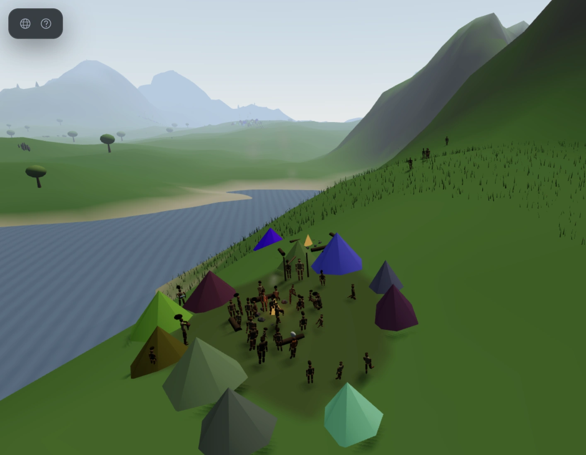
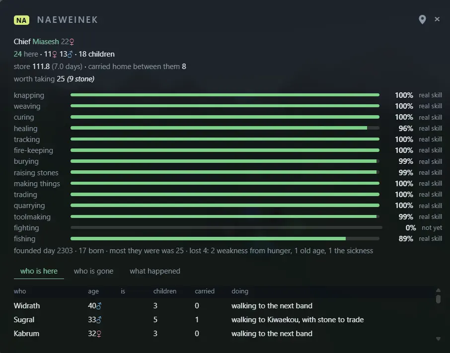
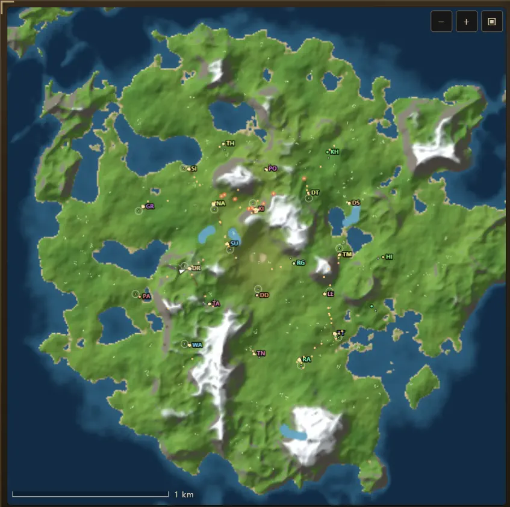
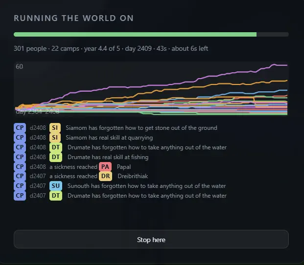

# Open World Sandbox

**An island that runs itself.** Procedural terrain, a physical sky on a running
clock, five species of wildlife — and a few hundred hunter-gatherers who forage
it, hunt it, learn twenty crafts, trade with each other, split off to found
new bands, bury their dead, and are still at it a century later.

Nobody scripts any of that. It is a simulation, and the history is whatever
happens.

**No build step, no assets, one dependency.** `index.html` and a folder of ES
modules are the whole program; `node:http` and `node:fs` are the whole server.
The dependency is the people: the low-poly body from
[humans-threejs](https://github.com/mudiadamz/humans-threejs), installed from its
GitHub repository on its main branch, loaded by the page straight out of
`node_modules`, and hung on the simulation's own rig — and dressed in everything else the library makes: four builds, a hide
tunic cut to each sex and build, six ways of wearing hair, three faces, the
library's baskets of fruit, fish and meat, a small animal carried in the arms,
and a pick and a knife for the work that uses them (`src/looks.js`).



## What you are actually watching

- **People with reasons.** Everyone has energy, hunger, a job and a family.
  They forage where it paid last time, hunt what they can catch, come home at
  dusk, sleep in a hut, fall ill, recover or do not. A tiger takes the ones who
  went out alone.
- **Bands that learn.** Twenty skills, each moving a number the simulation
  already had — curing meat means less of the store spoils, tracking means a
  hunter sees further, fire-keeping means a tiger will not come as close. What
  a band practises is what it has been worrying about, so a band good at
  healing is one that has been ill.
- **A world with a memory.** Births, deaths, splits, plagues, skills won and
  forgotten: all of it goes into a chronicle you can search, kept in SQLite
  across worlds and reloads.
- **Time you can skip.** Name a number of years and it runs them unwatched in
  seconds, then hands the world back.
- **Everything is a setting.** Forty-two environment variables, so a world is
  a `.env` file you can hand to somebody else.

<table>
<tr>
<td width="50%"></td>
<td width="50%"></td>
</tr>
<tr>
<td>Every band keeps its own books — who leads it, what it has worked out, what
it has lost and to what, and what each person is doing right now.</td>
<td>Twenty-odd bands on one island, each with a two-letter code that follows it
through the chronicle. Click anywhere to travel there.</td>
</tr>
</table>



*Five years in about fifty seconds, unwatched. One line per band, and the
chronicle beside it says what happened to them.*

## Have a look

```bash
git clone https://github.com/mudiadamz/web3d-openworld
cd web3d-openworld
npm install                     # the one dependency: the people
npm start                       # http://localhost:8080
```

That is the whole setup.

## Run it

Two ways, and the page is the same file in both.

**As a static page.** After `npm install`, `index.html` needs nothing but a web
server — the page loads the people from `node_modules`:

```bash
python3 -m http.server 8000     # then open http://localhost:8000
```

**With Node, so the defaults come from the environment:**

```bash
cp .env.example .env            # optional; every setting has a default
npm start                       # http://localhost:8080
npm start -- --port 8089        # ...or wherever. --host, --people, --map too
```

`npm start` is the development server: it restarts whenever `.env`,
`index.html`, anything in `src/` or the server's own files change, and the open
page reloads itself when it comes back. Change a setting in `.env`, save, and the
world is rebuilt with it. It also asks GitHub for the newest humans-threejs
before it starts, so a model pushed there is on the island at the next
`npm start`; `npm run model` fetches it without restarting anything else.
`npm run serve` is the same server without the watching or the fetching, for
leaving running; the Windows service runs that way too.

or without editing anything at all:

```bash
DEER=90 CAMPS=4 QUALITY=low SEED=777 npm start
```

One dependency, the people; `node:http` and `node:fs` are the whole server. Node 18+.

Opening `index.html` straight off disk usually works too, but some browsers
refuse ES modules on a `file://` page — if the loading screen sits there, it
will tell you so after six seconds. three.js r169 is pulled from a CDN
(jsDelivr), so the page needs a network connection either way.

## Configuration

Every knob on the panel can be given a starting value by an environment
variable, so a world can be described by a `.env` file and handed to someone
else. `.env.example` lists all forty-three of them with their ranges. Real environment
variables win over the file, and a `--flag` wins over both.

```
SEED  QUALITY                             the world
WIND  WIND_DIR  GUST                      wind
VIEW  FOV                                 camera
MODELS                                    real geometry for the wildlife
SHADOWS  WATER  SOUND  VOLUME  EXPOSURE   rendering and sound
TIME  DAY_LENGTH  PACE_DAY  YEAR_LENGTH   time, sky and seasons
GRASS  TREES  ROCKS  FLOWERS  FRUIT       vegetation
STREAMS  WAVES                            water
BISON  DEER  RABBITS  BIRDS  BUTTERFLIES  wildlife
CAMPS  PEOPLE  FERTILITY                  the band
PORT  HOST                                the server
```

**Nothing throws.** A sandbox that refuses to boot because someone typed
`DEER=lots` is worse than one that says so and carries on, so unparseable values
are reported and dropped and out-of-range ones are clamped — both to stderr, and
the server starts anyway:

```
  ! VOLUME: 9 is above 1 — clamped
  ! BISON: expected a number, got "lots" — ignored
```

Naming a `QUALITY` loads that preset's populations, exactly as picking it on the
panel does, and anything you set by name then wins over the preset — so
`QUALITY=low DEER=100` does what it says. `GET /config.json` returns exactly what
the server resolved.

How it works: the server replaces a `<!--CONFIG-->` marker in the HTML with one
small script setting `window.__CONFIG__`, and the page prefers that over its own
defaults when it is there. Served or opened directly, it is the same file — which
is what keeps `index.html` standalone.

## Worlds

A seed is a number nobody remembers, so worlds have names — drawn from the same
invented syllables their tribes are, from the world's own seed. **New world**
rolls a seed, names it, keeps it and takes you there; the dropdown takes you back
to any of them. Whatever world you booted into is put on the shelf too, so the
list is never empty and the world you are standing in is always one of them.

**The clock belongs to the session, not to the world.** Walk out of one world
and into another and the sun does not jump: the band you find there is new, but
it is born into the year already in progress, at the hour and the season you
left. Nothing puts the calendar back to day 0. There is no Restart: the year runs
from the first time you open the page until you close it for good, across every
world you visit. A world you are finished with is deleted, not rewound.

**Every world wears a two-character code in a colour of its own**, both derived
from the seed, so neither is stored and neither can drift. The code marks the
world on the shelf, beside the world you are in, and against every line in the
chronicle.

Kept in SQLite when there is a server (`GET`/`POST /api/worlds`, keyed by seed,
so saving twice renames rather than duplicates) and in `localStorage` when there
is not — and when there is neither, which is a real state in a private window,
the shelf degrades to the one world you are in rather than to an exception.

## A save has to fit through the door

`Error: body too large` — a stack trace on the server console and, in the page,
nothing at all. Three separate things, and the third was the one that mattered.

**The two caps had never been compared.** `LINE_MAX` is twenty thousand people
who have ever lived, at about 123 bytes a row: two and a half megabytes of
lineage before a single living person, grave or skill is written. The server
took one megabyte for every endpoint. Neither number knew the other existed, and
a long-running world walked straight past it — the more so now, with room for
two hundred people and twelve skills apiece.

The save endpoint has its own limit now, sized from the shapes the code actually
writes. Everything else stays at a megabyte: those are small, fixed-shape
messages, and a cap that fits them is a cap that catches a client gone wrong.
`test.js` computes the largest save the page could produce and fails if the
server would refuse it, so the two cannot drift apart again.

**The page read the refusal as a save.** It awaited the fetch and returned
without looking at the response, so a 413 was indistinguishable from success —
and the fallback that keeps the world in the browser, sitting directly below,
never ran. A world too big for the server was a world silently not kept. It
checks `res.ok` now.

**And the server dropped the connection instead of answering.** `req.destroy()`
fired before the 413 was written, so the client got a network error, which it
cannot tell from the server being gone. It falls back either way — but only one
of those tells it why. The request is paused, the status is written, and the
socket is closed after.

## Keeping your place

Reload the tab, restart the server, come back tomorrow: the band is where you
left it, at the hour you left it, as old as they had got.

The world is not saved, because it does not need to be — **a seed rebuilds the
terrain, the creeks, the camp sites and the herd anchors exactly**. What is saved
is the part no seed can reproduce: the clock, the tribes' names and stores, every
person's name, birth day, build and business, and how many of each animal the
hunting left. That last one matters: an over-hunted species comes back
over-hunted.

Written every ten seconds and whenever the tab is hidden, to SQLite when there is
a server — so it survives the server going down — and to `localStorage` when
there is not. Deleting the world clears it; `?fresh=1` ignores it for one load.

```
GET/POST/DELETE /api/state   one row, overwritten: a bookmark, not a history
```

## Deleting

There is one destructive action and it reaches exactly one world: **Delete
world** removes the world you are standing in — its place on the shelf, the
bookmark that would put you back in it, and its lines in the chronicle. Those
three go together on purpose: a chronicle line pointing at a world that no longer
exists is worse than no line at all.

Then it moves you on, because **there is always a world**. If another is on the
shelf you land in it; if that was the last one, a new one is made. The list
cannot be empty.

### Everything

**`npm run reset`** empties every table, in one transaction, and folds the
write-ahead log back in — that last part matters, because the log was four
megabytes against eighty kilobytes of tables and deleting rows does not touch
it. It stops short of removing the file, so a running server can carry straight
on with what is left.

There is a **Delete everything** button too, which does the same and clears the
browser's own copies with it. It asks twice, and it leaves a new world behind,
because there is always a world.

The command is the one that matters. This was taken out once, on the reasoning
that a single request should not be able to remove everything there is — and
then the reason for wanting it turned up: a page that will not behave, and no
way to start again from inside it. A button lives inside the page, and the usual
reason for wanting everything gone is that the page is the problem.

```
npm run reset            the database named in .env
npm run reset other.db   a particular one
```

It asks twice — the button arms itself, says *Sure?*, and disarms after four
seconds if you walk away. A native `confirm()` would block the page and look
like the browser talking; arming the button says the same thing in the same
place you clicked.

```
DELETE /api/worlds?seed=N    one world off the shelf
GET    /api/data             row counts, per table
```

## One band, in detail

The side panel says how many and how hungry. Clicking a band's row on it — or
pressing `T`, which opens whichever band you are following — says who they are:
the chief, then every member oldest first, with age and sex, how many children
a woman has borne, and how much food each of them has carried home in their
life. Under the name: what is in the store, what the band has carried home
between them, when it was founded, how many were born, the most it ever held,
and what it has lost and to what.

Two of those numbers exist nowhere else. **Children borne is counted from the
record of everyone who ever lived**, not from the living, so it counts the ones
who died — which is the number that means anything about a woman's life. And
**what each person has carried home** is the only place the simulation shows an
individual's contribution rather than a band's total, which is what makes it
obvious that a band lives on the work of the four or five adults in it.

## The chronicle

**The chronicle is a record of every world, not of the one you are in.** Load
another world and the list carries on; each line is stamped with the coloured
code of the world it happened in, and lines about a person name the band they
belong to. It is only ever emptied one world at a time, by deleting that world.

Served with Node, the page posts what happens to SQLite through `node:sqlite` —
built into Node, so the project still has no dependencies. The world itself is
never stored: a seed rebuilds it exactly, so what is worth keeping is what the
band *did* in it. Without a server the chronicle lives in `localStorage`, which
is the same list with a shorter memory.

```
GET /api/runs                list of worlds, with event and day counts
GET /api/chronicle?run=1     every hunt, every hungry night
GET /api/history?run=1       a row a day: people, food, animals, kills
GET /api/tribes?run=1        a row a day per tribe: people, children, food
GET /api/worlds              the named worlds you can go back to
```

Events are buffered in the page and posted in batches — a hundred separate
inserts is a hundred fsyncs — and written in one transaction. Opened as a plain
file there is no server and nothing is posted; the panel's list still fills, it
just does not outlive the tab. `CHRONICLE_DB` moves the file.

## People

Everyone is a man or a woman, and it is not a label — it is the build. The
broader-shouldered figure and the broader-hipped one were always in there; now
they mean something. **The thing you can read at fifty metres is the hair**,
short or long, and it grows with the child into whatever they will be.

It changes who is born. A camp needs at least one fertile woman *and* one
fertile man, and the birth rate is set by the number of women rather than by the
head count — so a run of sons is a real problem a generation later, which is the
sort of thing worth being able to watch happen. Nobody ill has children.

The panel counts both (`3♀ 2♂`), and the follow caption names the person, their
band, their age, their sex, and whether they are ill or worn out.

## Dying

Nothing dies of "mortality" any more. The chronicle says what of:

| cause | reads as |
|---|---|
| age | *Aro of Testtown died, 61* |
| infancy | *Cira of Mawimam died a child of 3* |
| hunger | *Beku of Testtown starved, 24* |
| sickness | *Wirik of Mawimam died of the sickness, 30* |
| tiger | *Sana of Testtown was taken by a tiger, 19* |

These are **competing risks**, not a list checked in order: every cause has its
own hazard, the total decides whether someone dies, and which one fired decides
what killed them. Drawing it any other way would quietly bury the rare causes —
there is a test that runs the draw two hundred thousand times and checks each
cause comes up in proportion to its hazard.

One function removes a person, so a death can never happen without a cause.

## What a band knows

Until now a band on day one and the same band fifty years later were the same
band. Nothing it did added up to anything, and knapping was an animation.

Three things it can get better at, each changing a number the food economy
already read:

| skill | what it buys |
|---|---|
| **knapping** | kill chance, up to +120% |
| **weaving** | what a foraging trip carries home, up to +90% |
| **curing** | how much of the store spoils, down by 65% |

What a band works on is what it needs. Hungry, and it makes spears and baskets;
comfortable, and it finally has the afternoon spare to build a drying rack —
which is why the racks arrive in a good year and pay for themselves in a bad one.

**Knowledge lives in people.** A camp's skill is capped by the best any living
adult remembers, plus a step. You learn by doing it, and a child grows up with
most of what the camp knew — most, not all. So a hard winter that takes the
elders takes the drying racks with them, and the grandchildren work it out
again.

Two bands on one map now diverge. In a six-day run one reached mastery of all
three while the other, having lost everyone who knew anything, sat back at the
14% a beginner manages unaided.

### The bug that made it inert

Skills climbed to exactly 14% in every band in every world and stopped dead.

The cap is the best living memory plus a step, and the only people who learned
were children, once, on reaching adulthood. Nobody's memory ever rose after
that — so the cap never rose either, and every band stalled at the step. The fix
is one line and it is the whole mechanism: **practice teaches the hands doing
it.** There is a test for it, because it is invisible from the outside — the
feature is fully wired, entirely tested, and does nothing.

### And the one that made it shout

The chronicle announced *"has mastery of curing"* and *"has forgotten how to
cure meat"* in the same minute, for ever. A band at the cap sits exactly on 1.0:
practice pushes it there and the fade pulls it a hair under, every frame. What
is announced is now compared against what was **last announced**, with a wider
margin to fall than to climb, because losing a skill is the louder claim.

## Families

Everybody has an id that is never reissued, and children are born to two named
people. The names are kept alongside the ids because a parent dies long before
the child does and *"daughter of"* has to still mean something afterwards.

```
[VT] Neimou was born to Laeler
[AK] Rerish, 72♀ · daughter of Sosein · foraging   ▮▮▮▯▯ 6/10
```

**Children look like their parents** — skin is the mean of the two with a little
drift, hair comes from one of them. A family is something you can pick out of a
camp by eye, and a band that has kept to itself for generations comes to look
like itself. The drift matters: without it every family converges on one shade
inside a century.

## Getting there

There is no path-finding and there does not need to be, but there does need to
be more than a step test. A person walked straight at their target and, if the
next step was too steep, **stopped and picked an entirely new errand**.

Now they try the way they are facing, and if it will not go they try further and
further off it — ±20°, ±43°, ±72°, ±109°, ±149° — until something will, keeping
the heading that worked so a spur is followed round rather than jittered along.
Boxed in on every heading, they take one step onto ground they would not
normally choose, which is the way out of a pocket. Walking round a hill is what
a person does; giving up and going home is not.

### Two bugs, one cause

**Nobody ever reached the next band.** The new errand was picked around the
walker's *own* camp, and for anything that is not a hunt or a forage it is
picked 2–9 metres from the fire. Camps are at least 260 metres apart, so the
first bump in the ground sent the visitor home. Every time.

**And the arrival happened anyway.** Every errand was allowed a flat sixty
seconds to get where it was going, and the timeout falls through to the arrival
case — which is right for foraging, where you pick what is around you wherever
you stopped, and wrong for a visit, where you cannot hand over food you never
carried anywhere. The arithmetic made it a certainty rather than a risk:

| errand | distance | time needed | time allowed |
|---|---|---|---|
| near forage | 26 m | 19 s | 60 s |
| far forage | 95 m | 70 s | 60 s ✗ |
| far hunt | 260 m | 72 s | 60 s ✗ |
| **a visit** | **260 m+** | **193 s** | **60 s ✗** |

So the far half of every foraging trip, most long hunts, and *every single
visit* finished by timing out somewhere in open country. The time allowed is now
the distance, at twice the pace it needs, because going round a hill is the
normal case. And a visit only counts if the visitor is actually standing in the
other camp.

Measured by driving the world: people spent 55–64% of their frames motionless
before and 46–47% after, and in a twenty-minute run somebody covers 469 metres —
further than the camps are apart, which is a journey that could only have been
made by walking round what was in the way.

## The bands, meeting

Two camps sat 260 metres apart for fifty years and never once noticed each other.

Somebody walks over now — when they can be spared, or when they are hungry
enough to go and ask. Three things come of it:

- **what they know goes with them**, so a rack built by one band eventually
  reaches the other;
- **food moves** from a camp that has it to one that does not;
- **the young sometimes stay**, which spreads the bloodlines and fixes a camp
  that has run out of women or men to have children with.

Moving is **once in a life**. Without that the bands churned — somebody moved on
almost every visit, half a dozen a day, and after a season the two camps were
the same people shuffled. They are meant to trade the odd person, not merge.

### Marrying out, and why it is not here

The third of those is the one that ought to matter most, and measuring it is
how this section came to be about a change that was removed.

**Eight people is too small a sample for a coin.** Sex is decided per birth, so a
run of sons is not bad luck, it is the ordinary amount of noise — and a band that
lands on one fertile woman and four men has no way back. It does not starve. It
stops having children, holds its number for a decade while the old die, and ends.
One measured world sat on forty-seven days of food at 1♀ 3♂ and ended anyway:

```
year  people  bands   food(days)   by band
   0      16      3          8.8   ...
   4      12      2         37.5   4f 4m   and   1f 3m
   8      12      2         46.9   forty-seven days of food and no children
```

So the obvious fix went in, and it is the one hunter-gatherers actually use.
Young adults marry out: the odds of staying with the neighbours weighted by who
is short of whom, and a young adult with nobody at home to have children with
weighting *visit* far above another basket of roots. It worked — the bands
stopped drifting into dead ends.

**It is not here, because it made things worse.** Paired across seven seeds, the
same world either way:

```
seed        11    22    33    44    55    66    77
without     14    20     6    15    11    14     9      7 of 7 worlds peopled, 89 alive
with        10     0    23     0    25    12    21      5 of 7 worlds peopled, 91 alive
```

More women having children meant the bands grew straight through the island's
food ceiling and starved in a heap, and both worlds it lost were lost that way.
It traded a slow, rare failure for a fast, common one — on an island that was
already surviving eight years out of eight once the tigers stopped catching
everything they chased.

Worth trying again if the ceiling ever moves. Not worth it against this one, and
the note is here so it is tried against a number rather than against a hunch.

```
[VT] Tsolel carried what they knew to [FP] Seisaer
[FP] Seisaer has a fair hand at weaving
[VT] Malim stayed with [FP] Seisaer
[5J] Tomak sent food to [AK] Thumo
```

## The chief, and the dead

Two things you can see from the ridge without opening anything.

**Whoever leads a band wears ochre and a white headband.** A camp is a dozen
figures the same size doing the same things, and finding out which one was in
charge meant opening a panel. Who leads is settled every time the band changes
— which is exactly when a chief can change, and the reason a dead chief used to
stay in ochre until somebody opened the band card.

**Somebody who dies leaves a cairn where they fell, and it stays.** Three stones
piled, small, and somewhere real: the ridge somebody was hunting on, the far
side of the island where a visit went wrong, the middle of a camp for the ones
who died at home. A death used to be a number going down — the only thing in
this world that happened without leaving anything behind to find. Walk far
enough after a few decades and you can read where the bad years were off the
ground.

The cairns are saved with everything else and capped at four hundred, because an
`InstancedMesh` cannot grow and a world left running for a century should not be
able to spend all of memory on headstones. When the cap is reached the *oldest*
goes, which is the wrong way round for a record and the right way round for a
view: what you can still find on the ground is living memory, and the chronicle
keeps the rest.

## Fish, and the raft

The island has had water round it since the first frame and nothing has ever
eaten out of it. A coast was the one piece of ground worth standing on for a
reason nothing in the simulation could see.

**Fishing is foraging with a different larder**, and it is built that way on
purpose: the same trip, the same arriving, the same haul into the same store, the
same baskets carrying it, and the same ground that runs down and grows back.
What differs is where it is worth doing.

**The good water is the deep water**, and two thirds of it is out of reach from
the bank. That is what a raft is for — the only thing in this world that opens
ground rather than improving what a band already does with it. A band builds one
once it has fished enough to be sure it is worth the wood, and it goes in the
chronicle like anything else a band works out.

**The sea does not have a winter the way the ground does.** Land forage falls to
0.35 of high summer; the water falls to 0.75. A band on a coast eats in
February, and a band that founded itself inland does not — which is one of the
few things that makes two camps on one island live differently, decided by where
their founders happened to stop.

**And it made the same mistake foraging did, for about ten minutes.** A single
landing per camp is everybody standing in the same water until it is fished out,
with nothing telling them to walk along the beach: the ground worked over a run
fell from seven patches to two. Fishing spots are chosen the way forage spots
are now — what the water is worth, less the walk, times a guess — so the
depletion pushes a band along its own coast and back a week later.

## Ground that gives out

Foraging read a noise field and nothing else, so a patch was worth exactly as
much on its thousandth visit as its first. And every forager in a band works the
same best spot out of the same numbers — so the whole band walked to one place,
for ever. There was no mechanism by which it could have done anything else: the
ground could not run down, and nobody had an opinion of their own.

**The ground runs down now.** A completed trip takes from a coarse grid of what
is left, and it grows back over the following days — proportionally, like the
fruit, so a stripped patch recovers quickest and a lightly-worked one is barely
marked. A patch stands about two trips before the ground next to it is worth the
walk, which is what sends the third forager somewhere else. It never reaches
nothing: there is always something there.

Eight metres a cell — about the ground one person works in an afternoon — and
one float apiece, so a 3200 m island is 640 KB. It belongs to **the ground**
rather than to a band, so two camps sharing a hillside strip it between them.
That is what `GROUND.range` and the crowding rules were always about, and what
they had no physical basis for until now.

**And nobody has to agree.** Where a spot is worth going is a guess, not a
measurement: the value is jittered by about a fifth either way, small enough
that a good patch usually still wins and large enough that a close second
sometimes does. The jitter multiplies the whole value, fruit and ground
together — applied to one term and not the other it would be exactly the
preference the "weighed in food, not in preference" rule exists to keep out.

Measured over a driven run, a band went from holding **three** places worth
foraging to **six**, and no patch was picked past 38%.

## Ground

Three bands shared one island and nothing about that was true of any of them.
They visited, they traded, they sent people to stay — and they foraged straight
through each other, because a patch of ground had no owner and the only limit on
a band was how far somebody would walk. Fine while the island is empty; wrong the
moment it is not, and it is not: over five years the store fell from twenty-two
days to nine as the population doubled.

Two rules, both pressure rather than rules.

**A forager weighs somebody else's ground as worth less than it is** — the walk
home past their fire is not worth the basket. The discount is multiplied by
`(1 - hunger)`, so it stops applying exactly when the two bands start to be a
problem for each other.

**And a band squeezed for long enough moves.** Not driven off and not a fight:
being crowded while hungry builds up day by day and eases off twice as fast when
it stops, and when it has built up for long enough the band **with fewer adults**
picks up and goes somewhere with room — which is what a band without granaries or
walls actually does. Everybody gets a hut in the new camp, because a reference to
the old one is a person walking to where their house used to be.

## A frame is a step of the world

Not everybody is walked every step. Past `LOD.from` — two dozen people — they
take turns: `lodStride` decides how many groups there are and `turnStart` is
`worldStep % stride`, so each step walks one slice and steps over the rest.

`worldStep` was only ticked inside `stepWorld`, which is the *unwatched*
fast-forward. The watched frame updated people and never moved the counter — so
while anybody was actually looking, `turnStart` returned the same offset every
frame and `updatePeople` walked the same slice for ever.

Everyone outside it was not merely undrawn. They were never stepped: no job, no
movement, no ageing, and the zero matrix they were built with that nothing ever
overwrote. It stayed invisible while a band was small, because `lodStride`
returns 1 below the threshold and every index gets visited anyway, and it
arrived the moment a world grew past two dozen people — as most of a crowd
standing perfectly still and never being drawn at all.

Measured on a fresh world of 121 people, counting non-zero matrices on the head
mesh against the people who should have been on screen:

| | should be visible | actually drawn |
|---|---|---|
| before | 95 | **24** |
| after | 88 | **88** |

The fix is one line: a watched frame ticks the step too. It is the same shape as
the book-keeping directly below it — two paths through the world, and anything
either owes has to be paid by both, which is why `bookDue += simDays` appears
twice and is checked for appearing twice. `tickWorldStep()` now is as well.

This is also why the harness kept reporting that nobody walked anywhere: the
band was not refusing to forage, most of it was never asked.

## What is worth telling

The chronicle keeps everything, and everything is mostly hunting. Counted on one
real world: **655 lines, of which 238 were kills**. Twelve lines of panel fill
with those inside a minute, so the day a band worked out how to cure meat goes
past between two rabbits — and the thing you actually want to know, that three
bands split away and who led them, is three lines out of six hundred.

So the panel and the window show **the band's own history** by default. That is
what it worked out and what it forgot, who walked off to start their own fire and
who went with them, who took somebody in, who fed whom, the days the store ran
out and came back, and the day a band ended. What they have in common is that
every one is about the band rather than about a person having a Tuesday.

Hidden: kills, births, deaths, a tiger missing, the last of the fruit, one person
catching a sickness off another. **Nothing is dropped** — the filter is a way of
looking, not a way of recording, and one button gives the whole list back. The
panel and the window read the same flag, so they cannot show different answers to
the same question.

One kind had to be split in two to make this work. `sickness` was both "a
sickness reached this camp", which is the band's news, and "they caught it from
the ones they were sitting with", which is not; sharing a kind meant neither
could be filtered without the other. The first is `plague` now.

### A band only learns a thing once

The filter alone was not enough, because the loudest thing in the record was a
bug. `camp.told` is which rung of a skill the band has already been *announced*
as standing on. It is derived from `camp.skill`, so it is not saved — and it was
not worked out again on the way back in either, so it came back as the zero a
fresh camp is built with, and every reload re-announced the entire ladder. A band
that had known how to cure meat for eighty years learnt it again, in four steps,
every time the page came back.

The numbers from that same world, and they are not close:

| | |
|---|---|
| `learned` lines | 236 |
| days they happened on | **6** |
| lines inside a same-day burst of six or more | **236 — every one** |
| biggest single day | **72 announcements** |
| honest ceiling: 4 rungs × 3 skills × ~4 bands | 48 |

Every skill line in the history was a reload, not a band learning anything. The
restore now works `told` out from `skill` through the same `skillTier` the
announcement uses. Storing it instead would be the same fact written twice, which
is how two copies come to disagree — the save carries the mastery and not the
announcement.

## Indoors

A camp of a hundred and forty was a hundred and forty figures standing in a
clearing seventeen metres across. Everybody who was not walking somewhere was
drawn, whatever they were doing — sitting by the fire, knapping, sitting with the
ill — and every toddler in the band underfoot among them. From any distance it
read as a crowd scene rather than as a camp.

**A camp is tents with people in them.** An errand either takes you out of the
camp or it does not: foraging, hunting, walking to the neighbours, children
playing — and sitting at the fire. Knapping, sitting with the ill and sleeping
happen under a roof. Anybody indoors is not drawn. **Toddlers stay in** whatever
else is going on.

**Sitting at the fire was on the wrong side of that line**, and it is the one job
whose name says where it happens. Somebody "at the fire" was hidden inside a
tent: the card said one thing and the camp showed another. It was also the
largest group of people never being drawn — with a full store the job weights put
better than a third of a band on it — so a well-fed camp was mostly an empty
clearing. Measured over the same boot with nothing else changed, moving `tend`
outdoors took the band from **1 of 3 drawn to 2 of 3**.

They sit where you would sit: `FIRESIDE` puts them between 1.8 and 4.0 metres
out, inside the ring of tents and outside the ring of stones. The huts stand 6.5
to 9.1 metres from the fire and are a couple of metres across, so their inner
edge is about 4.1; the fire's stones sit at 1.15. The old range was the generic
`[2, 9]` shared with knapping and nursing, which put fire-tenders among the tents
and sometimes inside one — which never showed, because they were not drawn.

**And the words follow the figure, not the job.** A job says what somebody's
hands are busy with; it says nothing about whether you can see them, and the two
came apart the moment anything was hidden. `doingWords` keys off `p.hidden` — the
flag the draw loop sets — so somebody under a roof reads *resting* or *knapping
in a tent* rather than *at the fire*, and somebody at the fire is at the fire and
on screen. It is the same rule the click-picker follows: one answer to "is this
person visible", written once and read everywhere.

Not drawn is all it is. They are still there, still eating, still catching things
off each other, still counted by everything that counts people — `indoorsNow` is
read where people are drawn and nowhere that decides anything, and a test fails
if that stops being true.

**Indoors is not asleep**, and the difference matters: asleep recovers energy
several times faster and is what the rest of the simulation means by *out of
reach*. Somebody knapping under a roof is neither. Rolling the two together would
make a whole camp untouchable and well rested.

Measured on a village of 105: **5 figures on screen**. On a band of 16 in the
morning: 10 of 16. How many you see is really how many are out working, which is
the number that was always interesting and was never visible under the crowd.

## A camp is a village that has not grown yet

Fourteen tents in one ring around one fire was the only thing a band could ever
be. Past that the ring was full, everybody left over shared the last tent, and
`SPLIT.at` sent half of them over the hill at seventeen people — so a band that
was doing well was a band that split, and no band was ever big.

Three things changed together, because none of them works alone:

**A tent per household.** That part was already true — a pair and the children
that belong to them get one tent, whatever its size, and the unpaired share,
because a camp is short of shelter rather than of ground. What was missing was
anywhere to put the fifteenth.

**A hearth per cluster of tents.** Fifty tents in five clusters of ten, each
round its own fire. Tents fill their own hearth's ring before the next hearth
is used at all, so a band that grows *lights another fire* rather than packing
more tents round the first — which is the difference between a village and a
crowd. A fire is lit only once there are tents round it, so a band of one
household still looks exactly like the camp it always did. Each flame burns on
its own beat: five fires on one flicker read as a mechanism rather than as fire,
and the smoke is shared out between the ones that are lit rather than all
rising off the middle.

**One point light for the village, not one per hearth.** A real light is the
most expensive thing a camp owns and there can be a hundred and forty camps;
five apiece is seven hundred lights in a scene that otherwise manages with the
sun. One in the middle lights the whole village, and the fires are emissive so
every hearth still reads as burning.

**And people live at their own hearth.** The village had its five fires and
nobody sat at four of them: everything meaning "go home" — dusk, an errand
ending, a job by the fire, a hunt finishing, seven call sites in all — aimed at
`camp.x`, and `camp.x` is hearth nought. Sixty people walked past four burning
fires to stand at the first one, and the hearths were furniture.

Which fire is yours comes off your tent, so a household sits together — the
same rule that put their tents beside each other. The exception is a tiger:
running for the fire takes the *nearest* one, because everything else about
going home is about where you live and that one is about getting behind a fire
before it reaches you.

That change found an older bug in the same place. `assignHuts` decides both
which tent you sleep in and which fire you live at, and it ran only when the
band changed — a birth, a death, somebody leaving. So a freshly built world had
no households at all: every hut hidden, every person walking to the middle of
the village, and the whole thing quietly coming right the first time somebody
was born. Founding a band is a change to it, and the largest one there is.

`SPLIT.at` is 60 now — about twenty-five households, half the tents a village
has, with the rest as headroom for the years when nobody has died. What sends
half a band over the hill is the walk out to the foraging rather than the room
by the fire.

Two numbers had to move with it, and one of them was a real bug caught by a
test that compares them directly: `CAMP_CLEARING` went from 17 to 26 so the
trampled ground covers the village, and `PANIC.fireSafe` from 14 to 17 so that
the ground a well-kept fire keeps a tiger off covers it too. At 14, the outer
third of every village was ground where somebody could reach their own tent, be
inside the camp by every other rule in the world, and be taken there.

And one that only a running world could catch: `CAMP_PIECES` is walked by
`buildCamps` to park every slot of the mesh each key names, so adding a `fires`
key to it — when the fires have their own mesh and their own count — was a
TypeError on the first frame of the first world.

## A camp you can read

Every camp looked the same whatever was happening to it. A band of four and a
band of fourteen had the same three huts, and a band that had worked out how to
dry meat had the same rack standing as one that had not, because the rack was
scenery. The one place the whole simulation is visible from — the ground — said
nothing about any of it.

**Shelters follow the band**: one per two people, never fewer than two while
anybody is alive, because a camp with one hut reads as abandoned rather than as
small. **The drying rack only stands once somebody knows what it is for**, and it
goes up the moment the skill crosses the line. It is the first thing a band
builds that is neither shelter nor fire, and the visible half of a number that
until now only ever appeared on a panel.

Both are read off state that already existed. The camp is laid out once and then
*dressed* — because the layout comes off the camp's own generator, and re-running
it every time somebody is born would shuffle the whole camp around them.

## A band's own card

Three tabs and a pin. **Who is here** is the roster; **who is gone** is the
dead and the ones who left; **what happened** is the band's own history.

That last one is the chronicle read the other way round. The chronicle is every
line from every world and it is searchable, which is the right shape for "when
did anybody last learn to cure meat" and the wrong one for "what has become of
these people" — so this is one band, milestones only, capped at forty lines. A
band's forty years is thousands of lines and eight of them matter, which is the
same filter the panel and the fast-forward log already use.

**A band is found in the record by the code its lines carry**, not by a stored
id — the same reason its colour is worked out from the code. A line is text: it
outlives the camp that wrote it and travels to another world's chronicle intact,
so `[TS]` in a line written forty years ago still says Tsekash and nothing has
to have been kept. A line that names two bands, which is what a visit or a split
looks like, shows up in both their histories, correctly.

And the pin in the header goes and stands there: **every overlay down, the
camera at their camp, the orbit pointed at the middle of it.**

It took three goes, and the two wrong ones are worth keeping because they are
the same mistake twice — a button that fails silently is indistinguishable on
screen from a button that is not wired up, so every theory about why it "did
nothing" looked equally good.

1. It travelled and left the card open, on the reasoning that the reason to go
   is to look at what the card describes. `#tribe`, `#chron` and `#keys` are all
   `position: fixed; inset: 0` with a dimmed, blurred backdrop, so the camera
   moved and you were left looking at the overlay.
2. It closed the card and no other overlay, which is the same bug with a smaller
   blast radius.
3. It read `tribeShown` out of another module's live binding at click time and
   returned silently when that was not what it expected. Now the card writes the
   band on the pin when it renders — the card is drawn for exactly one band, so
   that is the band, recorded where the click can reach it without asking
   anybody — and if there is still no camp it says `no band to go to` rather
   than doing nothing.

Clicking a band on the *map* still opens the card, and that is deliberately the
opposite gesture: there you are asking who they are, here you are asking to see
them.

## Who somebody is

Everybody made the same choice. Given the same hunger and the same tiredness
every person picked identically, so a band was a number and following one of them
was watching the average of all of them.

Three numbers, each around 1, each set at birth and each pulled halfway towards
the parents:

| | what it reaches |
|---|---|
| **bold** | how far out they forage, and how late they leave it before running from a tiger |
| **sociable** | how often they walk to the next band, and how readily they sit with somebody ill |
| **quick** | how much they get out of a session of knapping |

Deliberately few and deliberately blunt. There is no combat and nothing is rolled
against them; they tilt a weight that was already there, which is why a whole band
of bold people reads as a bold band rather than as a spreadsheet. Nothing can run
away either — a trait is clamped to 0.55–1.55 however the line goes.

The follow card names one only when it is worth naming. Most people are
unremarkable and it says so by saying nothing.

## Sickness

**Somebody sits with them.** Sickness became the leading cause of death — eight
of fourteen over five years — and it was the only one nobody could do anything
about: it arrived, it spread by crowding, it killed a tenth of the people it
touched a day, and every person in the band stood there watching.

Nursing shortens the illness by half again, and the person doing it may catch it,
which is what makes it a decision rather than a free improvement. One nurse can
sit with three. A band with nothing in the store cannot spare anybody to do it,
which is the same band the sickness is worst in.

**And it leaves the camp it started in.** A band that has it keeps to itself —
nobody walks to the neighbours out of a camp with somebody lying ill — so the
only way it crosses the island is a guest who left before it showed in them. The
chronicle names who brought it.

An illness arrives at a *camp* — one case, which then has to spread. It is
worse in winter (3.2× summer), worse in a crowded camp, and worse on an empty
store. It runs about a sim-day, and whoever is still standing at the end of it
is immune for six years, which is what stops a band being wiped out by the same
thing every winter.

While ill, a person stays in camp, moves at half pace, and gets much less back
from resting. Every rate is per **sim-day**, and a year is only twenty-four of
those — an illness that "runs for nine days" would be running for a third of a
year, which is exactly the mistake the first cut of this made.

Simulated over four thousand outbreaks in a camp of twelve:

| | fall ill | die | camps lost |
|---|---|---|---|
| fed camp | 11.9 | 2.0 | 0 |
| hungry camp | 11.9 | 3.8 | 1 in 4000 |

About one outbreak per camp every two and a half years, most of them in winter.
The first cut killed six of twelve in a fed camp and nine in a hungry one; that
is a plague, not an illness, and the simulation is in the test suite so the next
change to the numbers has to answer to it.

## The tiger

The only thing on the map that kills. One animal, hunting alone.

It runs the **same three states as every other animal** — lying up is `graze`,
prowling is `walk`, the charge is `flee` — which is why all the movement,
turning, tiring and drawing below it is shared code, and why a tiger runs out of
sprint exactly like a deer does. A tiger tops out at 7.4 m/s against a deer's
6.8, so a chase is only winnable once the deer has spent itself.

**It has a stomach, not a stopwatch.** `fed` runs from full down to empty over a
couple of days; below the threshold it starts looking, and a kill fills it again.
A full tiger walks past a deer — the herds graze a hundred metres away
untroubled — which is what a predator that is not hungry actually looks like, and
what makes the times it *is* hungry read as something happening rather than as
weather. Hunger runs on the calendar, so it is as hungry after a fast-forwarded
night as it would have been after a slow one.

It prefers four legs to two by a wide margin, so people die when they are the
only thing out there — which is when they are foraging alone, and a person is a
smaller meal than a deer. Anyone asleep in a hut is out of reach. Having made a
kill it eats where it stands, and hunts nothing while it does.

**The rush is eleven seconds long**, and that number is why the island is
survivable. The shared stamina above does end a sprint, but on the wrong
timescale — a tiger takes upwards of forty seconds to blow and it catches a
person in twelve, so it had never once ended a chase after a person. Every
chase that started, finished; eight years of it killed twelve of sixteen, and
the band went extinct. An ambush predator does not work that way. Now the rush
has a clock: still ahead when it runs out and the tiger gives up, then walks it
off for half a minute before looking at anything again.

It closes 42 m in those eleven seconds and a person notices at 46, so somebody
who looks up in time gets home and somebody caught out in the open does not.
That is the whole design of it: a graded risk rather than a verdict.

**Reaching the fire ends a chase already under way.** Skipping people in camp
when it *picks* a target is a different rule, and it was the only one there —
the pick happens now and then, so a tiger already running followed somebody all
the way in and took them at the hearth. Running home, the one thing anybody
does about tigers, was worth nothing.

## The boar

The competition. A boar eats fruit off the low branches and the ground under
them — **the same fruit the band was going to carry home**, out of the same
orchard, through the same code. So an orchard is not simply a resource that
regrows; it is one somebody else is also working. When there is none where it
stands, it goes and finds some.

They are in `QUARRY`, so the band can hunt them back, and taking one is a
reasonable answer to it having eaten the orchard: slower than a deer and worth
more than a rabbit.

Driven for four simulated days, the orchard **settles rather than being
stripped** — 3850 fruit down to 3246 with the decline flattening the whole way.
Regrowth is proportional to what is missing, so the more the boars take the
faster it comes back. `BOARS` sets how many.

The herds are afraid of it the way they are afraid of a hunter, so one crossing
the map is visible in how everything else moves. `TIGERS` sets how many.

## What a person looks like

Skin, garment and hair belong to **the person**, not to the slot they happen to
occupy in the instanced mesh, and the band is repainted whenever the band
changes — a birth, a death, or coming back to a saved session. The colouring is
saved with them, so somebody you recognise is still recognisable tomorrow.

It used to be written once, by slot, for the band the world started with. Two
things followed, both visible on screen while every test passed:

- anyone born afterwards took a slot nobody had painted, and **three fills
  `instanceColor` with one, not zero** — so they were drawn in pure white;
- a death moves everyone after it up a slot, so the band swapped skins, garments
  and hair around at every funeral.

The second one hid the first: it looked like an odd flicker rather than a bug.

The boot sweep that should have caught this was looking for **black**, found
none, and reported clean. It now checks people for unpainted white, over the
slots the band *occupies* rather than the ones currently drawn — at night
everybody is asleep inside a hut, so a check keyed to visibility passes having
examined nothing at all. It asserts how many slots it inspected for that reason.

That sweep only fires when a run happens to produce enough births to pass the
starting band, so it is a bonus rather than the guard. The guard is a set of
source checks: that colouring is read from the person, that all seven body parts
are painted, that every place the band can change repaints it, and that
`paintPeople` has exactly one early return.

## The counts on the panel

They move, and they mean something.

**Animals** is how many are alive. It used to be how many instance slots had
been allocated — a hunted animal keeps its slot so it can come back later, so
the number never budged however much the band ate. It goes down when a hunter or
a tiger takes one and up when one is born back into the herd.

**Fruit** is a real resource rather than scenery. A forager who finishes a trip
under a bearing tree strips what is within arm's reach: those fruit come off the
trees you can see, the count drops, and it grows back over the following days —
proportionally to how much is missing, and only in a season that bears. Nothing
ripens in a snowdrift.

Fruit is worth about a third of a forage trip on top of one that lands well. The
first cut made it worth 0.09 a piece, which meant a forager standing under a tree
brought home more fruit than forage and roughly doubled the food supply; there is
a test that holds the bonus under half the base yield.

The readout redraws twice a second, sharing a cadence with the frame counter.
Before that it only redrew when somebody was born or died, so a count that had
been quietly changing for a minute showed the old number.

Verified by driving the real page for eighteen thousand frames of simulated
time and watching both numbers: animals 191 → 178 across fourteen distinct
values, fruit 4610 → 4591 across seven. That drive found a bug in the harness
itself — its `requestAnimationFrame` stub returned early once the boot was
done, so a loop of forty thousand frames incremented a counter and ran no
simulation at all while reporting "40000 frames driven".

## The map

Off, a corner map, the whole window. `M` walks the three. It was five sizes
once, and 118 and 168 and 236 were mostly each other — four keypresses to make
a decision that is only ever "get it out of the way" or "let me look properly".

**Travelling puts a full-page map away.** Travelling is "show me that place",
and a map filling the window is the one thing between you and it: click a band
on the full map and you arrive behind the map you clicked, which reads as the
click having done nothing. It is the same mistake as leaving the band card up,
one layer further out — and it caught the pin too, which closes every popup and
then hands you a map. A corner map stays where it is; it is not in the way.

**A band on the map is a place rather than a coordinate.** Clicking one goes to
their camp — the rig lands on the fire, not on whichever metre of ground the
pointer was over — and opens their card beside it. The dot is drawn under two
pixels across, which is a fine thing to look at and an impossible thing to hit,
so what is clickable is a ten-pixel target round it, sized for a pointer rather
than for the island. The cursor says which of the three things a click will do:
a hand on a map you can drag, a pointer on a band you can go and look at,
nothing in particular on ground you can travel to. A target you cannot see is a
target nobody presses.

**The full page is a different object from the corner.** A glance needs a
relief and some dots; a map you are actually reading needs to say what it is
showing you, so at that size it also carries:

- **the band codes**, the same two characters in the same colour as the chip
  beside the name on the panel. Outlined rather than boxed — a label with a
  panel behind it hides the ground it is labelling, and there can be twenty.
- **the paths, as roads.** A worn track is about two and a half metres across,
  which is under a pixel at island scale, so it is drawn thicker than it is —
  which is what a map does with a road. Only where the ground itself has browned:
  a road on the map that is not under your feet when you get there is worse than
  no road. Cached into an image of the whole island like
  the relief and rebuilt only when `pathVersion` says the ground has changed;
  repainting a few thousand worn cells fourteen times a second to get the same
  picture is most of what the map would otherwise cost.
- **a scale bar** in metres or kilometres, a round distance with its length
  following, rather than a round number of pixels with a distance like 0.83 km.
- **zoom**, on the buttons or the wheel, and **drag to look elsewhere**. Past 1×
  it centres on where you are — finding yourself on the map is the reason to
  zoom — until you drag it, and then it stays where you put it, because being
  unable to look at the next valley without walking there is why that is not
  enough. Zooming back out is how you hand it back. It never scrolls off the
  side of the world.

  The same pointer does two things here, and the only thing between them is how
  far it moved: a click travels, a drag pans, and four pixels is the line. That
  is a `pointerup` that decides, not a click handler — a click handler cannot
  tell you what happened before it. Zooming crops the relief rather than re-rendering it, so a
  keypress does not re-sample a quarter of a million heights — it goes soft as
  you go in, the way paper does, and the markers on top stay sharp because they
  are drawn rather than sampled.
- **a frame**, and a button to put it back in the corner.

One transform serves both what is drawn and what is clicked, so a zoomed map
cannot disagree with itself about where something is — otherwise you click a
camp and travel somewhere else. Leaving full size drops the zoom with it: a
92-pixel map of somewhere you cannot identify, with no control on it to undo
that, is worse than no map.

## Seeing ahead

Name a number of years on the panel and press **Run years**. The world runs on
with nothing drawn, a progress bar says where it has got to, and when it stops
you are looking at what it arrived at.

The clock goes to 16× and 16× is nothing: a year is twenty-four days of
twenty-four minutes each, so watching a decade at full speed is six hours of
sitting there.

**It is not faked.** The food in a store is not a rate — it is what people
actually carried home, one foraging trip at a time — and a band's skills are
what its people actually practised. So this runs the real simulation, the same
functions in the same order, with everything that exists only to be looked at
left out: no camera, no grass tiles, no shadows, no map, no sound, no sky.

About **seven seconds of real time to a simulated year** on a default world, so
a decade is a minute. On a big one it is a great deal more: how long a year
takes depends entirely on how many people and animals are in it, and a band of
eighty with five hundred animals is nothing like the default sixteen. So the
overlay measures the rate this run is actually achieving and says how long is
left, from the first slice rather than the first percent — on a run long enough
to need an estimate, one percent is itself a long wait, which is exactly when
somebody wants to know whether to stop.

**And there is a Stop.** Escape works too. The years already run are real, so
stopping closes up exactly as finishing does and leaves the world where it got
to. Without it the overlay covers everything and the only way out is to close
the tab — which is what happened, on a world where "five years" was seventeen
minutes of work.

### The popup that would not close

Before any of that mattered, the overlay was on screen from the moment the page
loaded and never left. Every attempt to fix the button that was supposed to
close it was aimed at the wrong thing entirely.

`hidden` is an attribute the browser styles with `[hidden] { display: none }`
from its own stylesheet — and **any author rule with an id selector outranks
it**. The overlay had `#ahead { display: grid }` for its centring, so setting
the attribute did nothing at all. Every other overlay in the page carries an
explicit `#thing[hidden] { display: none }` for exactly this reason; this one
did not.

The boot check cannot catch it. Its DOM is a mock: `hidden` is a property it
honours by fiat, and there is no CSS engine to disagree. So there is now a test
that reads the stylesheet instead — it collects every id the page hides by
attribute, keeps the ones an author rule gives a `display` to, and requires each
of those to spell out `[hidden]` as well. `#map` is correctly not required to:
its own rule sets no display, so the browser's rule wins unopposed.

### Making Stop feel like it did something

The first Stop worked and felt like it did nothing, which is the same thing as
not working.

The click landed instantly. What followed was a single frame that rebuilt every
view of the world — refilling all eighty-one grass tiles among other things —
and **nothing can be painted in the middle of a frame**. Measured: 267ms at high
quality, and far more on a big world. So the overlay sat there, apparently
ignoring the click, until the rebuild finished and it vanished all at once.

Two changes, both about when the browser gets a chance to paint:

- **The click says so.** A click handler returns immediately and the browser
  paints before the next frame, so that is the only moment anything can be said
  at all. The note now reads `stopping…` and the button disables.
- **The overlay comes down a frame before the rebuilding.** One frame to hide
  it, then the browser paints the world, then the expensive frame — which
  nobody is looking at an overlay through.

The budget per frame came down from 28ms to 20ms as well: a frame is about
sixteen, so it still deliberately overruns, but it stays short of the point
where the page stops noticing input. The one button that has to keep working
while this runs is the one that stops it.

It runs in slices of 28ms rather than one straight loop — a browser given a loop
that long decides the page has hung, and a run that cannot say where it has got
to is indistinguishable from one that has crashed.

### The step is a distance, not a duration

How far anything may MOVE in one unwatched step is what has to be bounded; the
number of seconds that takes follows from it. A two-hour day runs at half the
pace of a one-hour day, so a step of it covers twice as many seconds for the
same movement.

Fixing the duration instead — which is what the first cut did — made a long day
cost twice the work for no extra fidelity. With `DAY_LENGTH` and `YEAR_LENGTH`
both at their maximum, five years came to **seven million steps**.

```
1.0 years · people 16 -> 15 · skills 21/40/91/20/31/58 -> 100/99/99/100/99/99
```

### And what it found the second time

A session of new mechanisms — paths, roles, raids, fishing, a graveyard — left
three simulated years 27% slower, and the fast-forward felt stuck. Profiled
rather than guessed at, and the first two guesses were both wrong: recovering
the foraged ground over the whole island grid, and re-serialising the chronicle
on every line, together bought nothing measurable. Both were worth fixing and
neither was the problem.

**The problem was that the unwatched world was still being drawn.** `stepWorld`
sets `drawingWorld` false, `updatePeople` checks it before posing anybody — and
does not check it before *hiding* anybody. Somebody indoors is parked out of
sight with seventeen zeroed matrices, and that was happening for every hidden
person on every step of a run nobody was looking at.

| | before | after |
|---|---|---|
| three simulated years | 10.4 s | **8.6 s** |
| spent writing matrices | 7.3% | **1.3%** |

That is the same mistake the herds had and were fixed for, arrived at from the
other side: the guard went on the half that draws somebody and not on the half
that unde-draws them. The first drawn frame afterwards walks the same branch and
parks them properly, which is why skipping it costs nothing.

Two scans were made cheap on the way past, both of which a busier world had
turned from small to significant. `pickFruit` walked every fruit on the island
for each completed trip — and walked all of them precisely when there were none
within reach, which is the common case; it reads a bucket index now, built once
with the trees. And the chronicle was serialised and handed to `localStorage` on
every line logged; it is flushed with the day's books instead.

### What it found


**The scenery was most of the cost.** Profiling the step showed birds and
butterflies taking longer between them than every herd, boar and tiger on the
map — and nothing in the simulation reads them. Nobody hunts them, they eat
nothing, they never die. They stop flying when nobody is watching, which took a
year from 13 seconds to 6.7. My first guess had been that writing out the
instance matrices was the cost; it was worth about one second in fifty.

**A latent crash.** A tiger that runs itself out of a chase reached for
`spec.hunt.rest`, which stopped existing when its stopwatch became a stomach.
Only a blown chase reached that line, which is rare enough to have gone
unnoticed — until a fast-forward ran a year of them in four seconds.

**And the clock did not catch up.** The corner is written by `tick`, and `tick`
does not run while the years pass, so the world was a decade older and the
readout still said the day it started.

### How coarse a step

Measured rather than chosen: at 0.5, 1 and 2 seconds a step the outcomes agree —
population, food and skills all land in the same range. At 4 they do not, with
skills reaching half what they should. It runs at 0.5.

## The clock

**− and + on the panel**, or `[` and `]`, step through 0.25× · 0.5× · **1×** ·
2× · 4× · 8× · 16×. The ends hold rather than wrapping round.

It is **one multiplier on dt, applied before anything else reads it**, so the
sun, the calendar, the seasons, the food, the growing and the walking all stay
in step. Scaling any of them separately is how you get people ageing faster than
they can walk home. Two things stay on the real clock on purpose — the wind and
the frame timer the toasts run on. Those belong to the room you are sitting in,
not to the world.

### The night runs itself through

By default, once there is nothing left to watch, the night is **run through
rather than watched**, and it takes a second or so. A `▶▶` beside the clock says
when.

It used to take five minutes. The night is half of a 3600-second day, and the
way it was skipped was to multiply `dt` by `NIGHT_SKIP_RATE` and let the frame
carry on as normal — 6× of 1800 seconds is 300 of them. Turning the rate up did
not fix it, because the mechanism comes apart above about 15×: `paced` is
clamped by `PACE_MAX_STEP` and `dt` is not, so past that point the books —
eating, ageing, births, deaths, the store spoiling — run at the full rate while
movement and sleep run at the clamped one.

| rate | clock per frame | movement and sleep | apart by | night lasts |
|---|---|---|---|---|
| 6 | 0.100s | 0.100s | — | 300s |
| 15 | 0.250s | 0.250s | — | 120s |
| 60 | 1.000s | 0.250s | **4×** | 30s |
| 600 | 10.000s | 0.250s | **40×** | 3s |

At 60× a band took a whole night's hunger and got a quarter of a night's rest.
That is why the setting was capped at 60 and a night still took half a minute:
it could not be raised without the clock leaving the sleeping behind.

So the night goes through `stepWorld` instead — the same machinery the
fast-forward uses, which decides what everybody does and skips writing the four
thousand matrices that draw them, and that is nearly all of the per-frame cost.
It cannot drift, either: `ffStep()` is `FF_STEP / pace()`, so `dt * pace()` is
exactly `FF_STEP` and the clamp never bites. The clock and the sleeping stay
tied together however fast it runs.

Measured on the boot harness, frames spent inside the night: **5,910 before,
82 after.** `NIGHT_SKIP_RATE` keeps its sense — bigger is a quicker night — but
it is a share of each frame now rather than a multiplier on the clock, so
raising it costs smoothness rather than correctness.

Two conditions, and the second one matters more than it looks:

- **Dusk to about fifteen degrees below the horizon**: anybody still out keeps
  the clock honest. Watching somebody come home late is worth waiting for.
- **Below that**: it runs regardless. Waiting on stragglers is right at dusk and
  wrong at two in the morning.

The first version waited on everybody all night, and in two runs out of eight a
single person who had wandered off held the whole night at 1×. A feature that
only works when everybody behaves is not a feature you turn on by default.

Set `NIGHT_SKIP=false` for nights that take as long as nights.

Measured in the boot check by driving a simulated day: the same four hundred
frames move the world **16 world-minutes at 1× and 64 at 4×**, and roughly four
thousand of thirty thousand frames come out fast-forwarded. That measurement
needed fixing too — the first cut timed two back-to-back windows and dawn landed
in the middle of the second, reporting 1.8× and looking like a broken feature
rather than a broken measurement. It now waits for a window the night skip does
not touch, and throws the window away if it turns on partway.

## How many bands an island holds

Every distance in camp siting was a number of metres tuned on a 1600 m island,
and on a 4800 m one they all still meant 1600 m — six bands huddled inside a
410 m circle in the middle of an island nine times the size, fighting over the
same ground. Sixty people down to nine. So they were all multiplied by
`MAP_SCALE`, which fixed the huddle and introduced a quieter problem: it scaled
two things that are not the same thing.

*Where* a camp may be placed is about the island — on a bigger one the sites
have to spread further out. How far two fires must be *apart* is about camps:
260 metres is 260 metres whatever the island measures. Scaling both cancels. A
disc 2.5 times wider than its own spacing holds the same handful of sites however
you multiply the pair, so a 6400 m island held exactly as many bands as a 1600 m
one and merely spread them thinner. Asking for forty camps got you seven on
every map in the game, and `.env.example` documented `CAMPS 0-5` because that is
what actually happened, while `config.ts` allowed 0-40.

So the placement radii still scale and the three spacings — `CAMPS_APART`,
`SPLIT.minAway`, `GROUND.apart` — are plain metres. `GROUND.range`, the ground
one band works, was already in plain metres and sits three lines above
`GROUND.apart`, which was not.

Sites placed when asked for forty, by map size:

| map | 1600 | 2400 | 3200 | 4800 | 6400 |
|---|---|---|---|---|---|
| before | 6.9 | 6.9 | 6.9 | 6.9 | 6.9 |
| after | 6.9 | 13.7 | 22.2 | 40 | 40 |

The default island is unchanged, which is the point: nothing about a 1600 m
world moves. A bigger one is now more bands rather than the same bands further
apart.

## Breeding is not planning

A band used to have children in proportion to how full its store was — half as
many at three days of food as at six. That is a population regulating itself,
and it is not a thing any species does. It also gave a flat line: bands found a
level and sat on it for thirty years, because the birth rate backed off long
before the store ever got low enough to kill anybody. All the starvation
machinery below it — `camp.hunger`, the `nourish` ceiling, `hungerMortality` —
was built and almost never fired.

Now the curve is a cliff. Above `FOOD.breedsUntil` they breed flat out; below
it, nobody is born. And that threshold sits *past* the point where the band is
already starving: hunger is `1 - days / comfortable`, so at 0.75 days of store
the band is at 0.875 hunger and the starvation ceiling started coming down at
`STARVE_FROM` = 0.82. The last child is born into a band that is already dying.

What that produces is the real shape — overshoot, crash, and a recovery on
ground that has had time to grow back — rather than a line. The regulator is the
crash. Nothing else changed: the three consumers of `FOOD.comfortable` are
untouched, because they are what makes the crash happen.

## Somewhere to put the dead

They were buried where they fell. That is defensible and it reads as nothing: a
stone in the long grass eight hundred metres out is scenery, and forty of them
scattered over an island are litter.

**Every band has one place it buries people**, picked once when the camp is
laid out, from the camp's own stream so it cannot wander when somebody dies.
Just outside the trampled ground — far enough that the village is not built on
its own dead, near enough to be theirs — on flat, dry ground, sited the way a
camp is. Somebody who dies out on the hill is carried back, which is the whole
difference between a grave and a place where somebody died.

The stones are laid in rows off the ground's own line, growing outward, so the
oldest are at the middle: **how big it is, is how long they have been here.**

## Making things, and getting them somewhere else

The ninth and tenth, and between them they are the two halves of having things
at all.

**`wares`** is the domestic craft — hides scraped and sewn, bedding, pots, the
carved and the useful. It is not weaving (that is `baskets`, and it is about
carrying) and it is not knapping. What it moves is **how well a band rests in
its own camp**: at mastery a night is worth half as much again, and the band
that sleeps well is the band that hunts. Only on the way up — home goods make a
night worth more, they do not make a chase cost less. It is worked at when there
is time to work at it, which is what a full store buys: a hungry band scrapes a
hide to carry meat in, a fed one carves it.

**`trade`** is dealings between bands, and like the graveyard pair it is learned
by doing it rather than by sitting down to it — you get better at trading by
trading, and both sides learn, because you cannot trade with somebody who is not
also trading. What it moves is **how much actually changes hands**: at mastery a
band moves half again as much of its surplus, which is the difference between a
neighbour who is fed and one who is merely visited. Never more than the surplus,
because more than all of it is not a trade, it is a subtraction.

It reads backwards for about a second — the band that is good at trading gives
more away — and then it does not: the band with a name for dealing is the band
that has dealt.

## Stone, and what it is for

The eleventh and twelfth are one chain rather than two more entries: somebody
gets it out of the ground, somebody else turns it into something that makes
every other job quicker.

**`mining`** is worked at an outcrop — one of the rocks actually scattered on
the hillside, because a spot invented for the errand is a person standing in a
field pretending. Only the ones big enough to be worth the walk; a pebble is not
a quarry. Nobody goes on an empty store (stone feeds nobody today) and nobody
goes when the pile is already high.

What it produces is not a number on a card but **a stock in the camp**. Stone
does not spoil, and that is the whole of what makes it different from food: a
band can hold it, and therefore trade it.

**`tools`** is what the stone is for. It does not sharpen a spear (`spears`) or
weave a better basket (`baskets`) — it makes **the work itself quicker**. An
errand that took twenty seconds takes twelve at mastery, so a day holds nearly
twice the errands, which is the difference tools have always made and it
compounds with everything else a band knows. Not sleep: a good axe does not
shorten a night.

**It cannot be practised without stone**, which is why the two are one thing.
`craftChoice` will not pick toolmaking with an empty pile, and a session that
does pick it spends what somebody quarried — taken where it is spent rather than
where it is chosen, so choosing stays free of side effects and can be asked
twice.

**And stone is traded.** It goes the way food does, only what is spare and only
to a band that has none, and dealing in it teaches dealing. That is what makes
it a good rather than a number in a camp. A band that walks away to found a
daughter camp carries nothing but what it knows: the pile stays in the ground it
was quarried into, and the new band starts at the rocks again.

*(There is no livestock to trade. Every animal in this world is wild — the herds
are hunted, not kept — so herding would be a subsystem rather than a skill.)*

## Taking it instead

A band with a full pile and a hungry neighbour is a fact about the world before
it is a fact about either of them. Until now the neighbour could only walk over
and ask, and a band with nothing to spare said no by having nothing — that was
the whole of what one band could do about another.

**A raid is the other answer, and nothing in it is new.** It is the same walk
over the hill a visit is — the same daylight, the same distance, the same
arriving — and the only thing that differs is what happens when they get there.
Hunger decides whether it is worth it, `war` decides how it goes, the store and
the stone pile are what changes hands, and the toll and the chronicle say what
it cost. There is no new resource and no new place.

**A band asks before it takes.** `RAID.hungry` sits past `VISIT.begFrom`, so a
band that could still walk over and beg, begs. That ordering is the whole ethics
of it and it is one comparison.

**What a band is worth taking from** is its surplus food plus its stone, and the
stone is most of it: food spoils at 18% a day, so nothing can hoard it, and the
pile is the only thing in this world that keeps. It is on the band card, because
it is the number that makes a band a target.

**How a raid goes** is the two strengths. Both sides are counted as they
actually stand — who is well, who is rested, who is a warrior — and the
defenders have their own camp behind them. Practice counts for more than
numbers: at mastery `war` is worth two and a half people, so six practised
defenders hold off twelve desperate raiders. What keeps it a gamble rather than
an arithmetic problem is that a hungry band cannot see how the other one has
been eating.

Both sides get better at it, which is the uncomfortable part and the true one: a
band that has been raided knows how to hold a camp. And somebody may not come
back — the losing side pays it, `raid` is a way to die like the tigers and the
sickness, and it goes in the tally.

**The warrior** is a role rather than a job, because there is nothing to do all
day. They lean on tending the fire and they are who a raid is made of; what
makes them warriors is being at home when somebody comes for it. A band keeps a
few once it has anything worth taking.

## Roles, which a band has to be able to afford

A band of eight is eight people doing whatever needs doing, and that is right:
there is no room in a hungry camp for somebody who only knaps. A band of forty
with a full store is a different thing — it can afford somebody who is *the*
knapper, and it gets better at knapping because of it.

So specialising is not a setting. It is something a band can afford, on two
conditions that already meant something before this existed: **six households**,
so the work can be split, and **eight days of food**, so a week of somebody not
foraging does not show. Below either, everybody forages and the roles go away
again — which is what a bad winter does to a village.

| role | leans toward | will not |
|---|---|---|
| chief | tending the fire | forage, hunt, quarry |
| hunter | hunting | — |
| toolmaker | knapping | hunt |
| healer | sitting with the ill | hunt |
| fire-keeper | tending | hunt |
| quarrier | the rocks | — |
| trader | walking to the next band | — |
| *(everyone else)* | foraging | — |

**A role is a bias, not an assignment.** It multiplies the weight of its own job
and zeroes the ones it refuses, so a toolmaker still eats, still sleeps and still
runs from a tiger; they simply do not spend the morning on the hill when there
are twenty people who will. The chief is the one this is really for: they tend,
they are there, and they are not out foraging.

**Who gets which is what they already know.** `p.knows` is a person's own memory
of each skill, so the band's best spear-hand becomes the hunter — the same
number `pickChief` reads and the same one that caps what a camp can learn. A
band specialises along the grain of what it happens to be good at, and a band
that has never been to the rocks has no quarrier: it has people who sometimes go
there, which is where quarriers come from.

How many of each is a share of the band, so a village of forty has four hunters
and a camp of ten has one. It is worked out for the whole band at once, once a
day, because the shares are a fact about the band — you cannot ask "am I the
healer" without knowing who else wanted to be.

The band card has a column for it, and the follow caption says it. Both stay
blank for a band too small or too hungry to have divided the work, which is the
column doing its job rather than failing to.

**Two more buttons on the order row**, for the two errands a grown band has and
a new one does not: work the rock, and go to the stones. There is nowhere to
quarry until somebody has found the rocks, and nowhere to stand until somebody
has been buried.

## Fourteen skills, and where they live

`life.js` grew past the length of the page it was split out of, which is a rule
this project keeps rather than a number it happens to be under. So what a band
knows is `src/skills.js` now: one subject with one edge, which is what made it
the piece to move. Nothing changed on the way across.

`life.js` **re-exports** the names rather than every importer being repointed —
eight modules import them from there, and a move that is invisible to all of
them is a move that cannot break any of them. It imports them back for its own
use, because a re-export binds nothing locally.

Eight of the fourteen are worked at the fire: `craftChoice` picks what an
afternoon's work improves. Six are not. Two are learned at the graveyard —
going back to it, and raising something over it — one by walking over the hill
to the next band, one at a rock, one when somebody arrives to take what you
have, and one standing in the water.

`life.js` has since shed the larder as well — where food comes from, ground and
water, in `src/larder.js`. It is handed positions and asked what they are worth,
and knows nothing about people, camps or days.

## From band to city, and what it looks like

A settlement climbs a ladder — band, tribe, chiefdom, village, city — by what
it has become (`src/society.js`), and **each rung shows on the ground**. A
chiefdom raises a hall for its chief. A village stops living in tents: timber
houses under hipped thatch go up on the spots the tents stood on. A city builds
in brick, two storeys under flat roofs, and has a **market** — stalls round a
well — and a **wall** round the whole of it with a gate on each quarter,
following the edge of the place as it grows and leaving gaps where the ground is
water. The hall and the market take the next good spot out from the middle, in
the same rings the outskirts grow in, so they never stand on a tent, the dead or
the field.

A city is laid out in streets rather than rings round fires, and has **no fire**
at all: where its last one burned, in the middle of the plaza, stands the **city
hall**, with the band's flag on its tower. Its plaza and streets are **paved**,
and roads run from it to every village of its tribe and between the cities —
the shortest set that joins them all — in a colour of their own on the ground
and on the map. A road is laid, not worn: it never grows back.

People walk slower through grass and scrub than on a trodden path, and faster
still on a road. So a walker takes a path when one near enough runs their way:
whichever heading gets them there soonest. Worn paths get used, and get deeper.

The land is mostly open, flat country: a plain that rolls a few metres, with
hills kept to a few regions and the mountain ranges rarer. There is no sea in
the middle of the island, and the sea's swell dies before the coast, so no
wave stands up through the plains. The lowest inland ground is a valley floor above the
water, so the only water inland is a lake where a creek ends.

The big map has a Creeks layer: every creek, from the spring or glacier it
rises at to the sea, lake or creek it ends in, drawn as wide as the water and
widening downstream, sharp at any zoom, with a mark at each source.

The big map marks where the food comes from, fields and fish included: each
band's farm from the day it starts digging the ditch, and the best water off
every coast, sized by how rich it is today (deep, in season, not fished out),
noting when a band has no raft to reach it.

What the food is kept in climbs too: a band's granary on stilts, a village's
timber storehouse on staddle stones, a city's cluster of domed brick silos.

And a city lives differently: its people spend mornings at the market, which is
how a city gets better at dealing, and its children play in the square.

## Clothing, the twenty-first

Hides were always worn. **`clothing` is sewing them into clothes, and you can
watch a band learn it:** sleeves at the beginnings, leggings at a fair hand,
cloth dyed in the band's own colour — the one on its chip and its dots on the
map — at real skill, and at mastery a fur cloak over the shoulders in winter.
Each goes on the day the chronicle says the band has got there, and comes off
the day it says they have forgotten.

It is worked at the fire, a little all year and most in the autumn before the
winter it is for. What it moves is what the cold does: at mastery a band keeps
out sixty percent of what winter adds to a sickness arriving and spreading, and
the person you play loses that much less resting out in the open at night.

## Stones, which is the eighth

`rites` is going back to the graveyard. **`art` is what a band does once going
back is not enough:** it raises something over its dead.

The form is the band's own, drawn once off its own stream — a ring, an avenue
leading in, or a cairn — so two villages a kilometre apart have raised different
things and neither of them chose to. How much of it is standing follows their
`art`, so it goes up over years rather than appearing: a band at a tenth has a
few stones on end, a band at mastery has the whole ring. It is the first mark
any of them leaves that is not shelter or a tool.

It is learned at the ground and nowhere else. Six of the eight skills come off
`craftChoice` — the things a band gets better at by sitting down and working at
them — and these two do not: going back to the graveyard, and raising something
over it. The people who go back are the people who raise them.

**And it moves a number, because a skill that only shows on a readout is a
readout.** A band that has raised something is a band the neighbours walk to:
`otherCamp` picks the nearest camp, and a monument counts as nearer than it is —
at mastery a band pulls from three times as far, which is the difference between
the next valley and the one after it. Visiting is how everything one band knows
reaches another, so a gathering place pulls ideas toward it. That is the least
romantic and most defensible thing a monument has ever done.

Losing it does not take the stones down; they are still standing. What a band
loses is being able to **say what the stones are for**.

**The graveyard is on the map**, in a pale stone colour nothing else on it uses —
the island is greens and browns, the bands are their own colours, the paths are
trodden earth. What is standing there shows as a ring round the mark rather than
a bigger mark, because how much of it there is, is the thing worth seeing from
above, and where it is, is not.

## Belief, which is the seventh thing a band can be good at

The other six are techniques — knapping, weaving, curing, healing, tracking,
fire-keeping. This one is not. A band that buries its dead in one place and goes
back to it is doing the oldest thing people do that no animal does, and it is
learned exactly the way the others are: by doing it.

- **A burial** teaches it most, and it is rare. The rite comes from the death.
- **Going back** teaches it a fifth as much, and there is a job for it —
  somebody walks out to the stones and stands among them for an afternoon. It
  needs a band that has buried somebody, and a hungry band stops going, which is
  most of what makes it worth having: it is the first thing to go.

**And it does something, because a skill that only shows on a readout is a
readout.** A band gives up its ground when it has been squeezed for
`GROUND.patience` sim-days — a rule about food and crowding, and the right one.
A band with its dead in the next field weighs that differently: at mastery it
endures two and a half times as long before it will walk away. Sometimes that is
why it comes through a squeeze that would have scattered it. Sometimes it is why
it starves where it stands. That is what belief is for.

Like the others it can be lost, and the words for losing it are not "forgotten
how to bury" — a band that loses this has not forgotten how to dig a hole. What
goes is the going back.

## Six things a band can be good at

Three was not enough to make two bands different from each other. Every band
that lasted learned all of them, so *what is this band good at* had one answer,
and the three skill bars were three gauges that all filled up.

| skill | what it moves |
|---|---|
| knapping | the chance a thrown spear kills |
| weaving | what a foraging trip carries home |
| curing | how much of the store spoils |
| **healing** | how much a sickness kills — `herbCure` takes 55% off it at mastery |
| **tracking** | how far a hunter can pick something out — half as far again |
| **fire-keeping** | the ground round a fire a tiger will not cross, 9m out to 23m |

Each of them moves a number the simulation already had. A skill that only shows
on a readout is a readout, not a skill.

The nicest is healing, because of where it comes from. What a band practises is
weighted by what it has been worrying about, and the weight on herbs is the
share of the band that is ill right now — so a band learns to treat a fever
*because it has been having fevers*. The bands that are good at healing are the
ones that have been through something, and you can read that off the card years
after the last of them died of it.

Fire-keeping is the other one worth watching. At mastery the sanctuary is about
the width of the trampled ground round a camp, which turns "reach the fire" into
"reach the camp" — the difference between getting home and getting nearly home
with a tiger behind you.

Adding a seventh should be one edit. The set of them is built from `SKILLS` by
`emptySkills()` rather than written out, which it was in five places; the save
is keyed by name rather than ordered, because an ordered array quietly hands
everybody's knapping to the weavers the day a skill is inserted anywhere but the
end; and a check fails if any skill has no effect, no craft weight, or no word
for forgetting it.

## What the tiger will come after

A tiger was killing 73% of everybody. That is not a difficulty setting being too
high; it is a rule that was described in a comment and never written down in
code. The comment said a tiger "prefers four legs to two ... but it will take
somebody who is out alone", and what the code did was score a person as six
times their real distance and otherwise treat them exactly like a deer.

Preferring four legs only helps when four legs are in sight. Two hundred animals
spread over an island 900 metres across is *less than one animal* inside the
62-metre circle a tiger sees a deer in — so most of the time there was nothing
four-legged to prefer, and a person alone in an empty stretch was simply the
best thing on offer, from as far off as a deer. That is the whole bug.

So "out alone" is now four things, and the last one does most of the work:

| rule | what it does |
|---|---|
| `prefersAnimals` | a person scores as 6× their real distance — anything with four legs in sight wins. This was the only one that existed. |
| `seesPeople` | it does not notice a person past 22 metres, against 62 for a deer. It has to nearly walk into them. |
| `company` | somebody with another person within 15 metres is not considered at all. A foraging party is not a foraging person. |
| `desperate` | none of the above happens unless its stomach is below 0.22. It starts *hunting* at 0.55. Between the two it hunts, and what it hunts is deer. |

Measured the way everything else here is measured — six seeds, eight years each,
counted off `lineage` rather than off the panel, which shows a band's two
leading causes and silently drops the rest:

| | as it was | + sighting rules | + `desperate` |
|---|---|---|---|
| tigers as a share of all deaths | 73% | 44% | **26%** |
| tiger deaths over six seeds | 38 | 27 | **15** |
| alive at eight years, six bands | 87 | 105 | **112** |

The middle column is why all four rules are there rather than two. Halving the
sighting range moved it a long way and still left tigers the leading cause of
death, because a hungry tiger with no deer in sight will simply walk until it
finds somebody. The hunger gate is what makes that a rare state instead of most
of a tiger's week.

They still kill. Fifteen deaths over forty-eight band-years is a tiger worth
running from, and on seed 20260906 — the one that started this — it is still
seven of ten deaths, because the hunting is poor on that island and a tiger that
hunts poorly is exactly the one that comes for people. That is the mechanism
working, not the mechanism failing.

The measurement itself needed fixing first. `PROBES=survive` was reading the
tribes panel, which prints a band's top two causes — so a run where six died "4
of hunger, 1 of old age" had a death nobody could see, and a band wiped out
entirely took its whole toll off the board with it. It now reads `lineage`,
which carries every person who ever lived and what became of them.

## Somewhere, as against somebody

`F` answers *show me somebody*. In Orbit the question is *show me somewhere*,
and there was no answer to it but flying there — which on a 3200m island is a
long way to go to find out there is nothing at the far end. `R` is the same
shape as `F`: it puts you in the mode it needs rather than making you cycle to
it first, and pressing it again finds somewhere else.

It picks the flattest of sixty tries that are on dry land and inside the island
— the same three tests camp siting uses, because a spot that fails them is a
spot with nothing to look at — and comes in on a random bearing, so twice in the
same place is still a different picture. The orbit pivot moves with the camera,
or the next drag spins the world around a point you left behind.

Reading the source cannot tell you it lands anywhere real, so the boot check
presses it twenty times and asks where the camera ended up: on land, inside the
island, above the hill rather than inside it, and somewhere new each time. That
probe runs **last**, deliberately — it draws from `Math.random`, which the
harness pins so a seed replays, and sixty draws a press moves the stream under
everything after it. Put in the middle of the file it did exactly that, and four
checks about bands and burials started failing on a world that had quietly
become a different world.

## The one figure you are actually looking at

Turn-taking is invisible at the distance a crowd is seen from and very visible
at three metres. In Follow the one figure on screen is the one being grouped, so
it stepped four times as far, four times less often — a judder on the only thing
you were watching.

It had never shown, because it could not: while `worldStep` was frozen the
followed person was either permanently inside the one group and perfectly
smooth, or permanently outside it and frozen solid. Fixing the step made the
grouping real, and made this visible with it.

So whoever the camera is locked to is not dealt into a group. They take their
turn every frame and get one frame of time rather than the whole group's wait —
otherwise they would walk at `stride` times everybody else's pace. It costs one
extra person a frame against a saving measured in the hundreds, which makes it
the cheapest exemption in the file.

## Following somebody

**F looks for somebody doing something.** On a fed island a third of a band is
under fourteen, and what a child does is play, run about, sit at the fire and
sleep — so F landed on one four times out of five, and you pressed it again.
That is F not working rather than F being unlucky.

The pool it picks from is now: an adult, on screen, on an errand. Everything
under that is unchanged and is what makes the preference safe to have — the
fallbacks were already there, because refusing to pick anybody is worse than
picking badly, and a camp can genuinely be all children asleep in the rain.
Measured with two adults put out on a hillside among fourteen children and
sleepers: a hundred presses, a hundred adults on errands.

Sitting with somebody who is ill is deliberately not on the idle list. It looks
like sitting down and it is the most interesting thing in a camp with a sickness
in it.

**And never the person you are already behind.** That is not a nicety: narrowing
the pool meant a band with exactly one adult on an errand handed you the same
figure every time you pressed F, which is F doing nothing. The exclusion applies
to both pools that can afford it.


`F` puts you over their shoulder and picks somebody at random; `F` again finds
somebody else. It used to take `C` three times to cycle into Follow and then `N`
to find anybody — four keys to do one thing.

### Taking them by the hand

Following is watching. The other half of it is that the person you are behind
does what you say instead of what they were going to do.

| | |
|---|---|
| **click the ground** | they walk there, on their own, with a ring on the spot |
| **click again** | they turn round and walk to the new one |
| **hold `W`** | run instead of walk |
| **`shift`+`W`** | let go |

Running is a jog and is charged for like one. The speed is set before the
clamps that everything else goes through, not after, so it costs energy, slows
with a full basket, and gives out when there is nothing left — a run you could
hold for ever for nothing would make walking pointless, and a band you run
everywhere arrives tired and hunts worse.

A click used to mean *follow that one*. It does not any more: "go there" is a
thing you say about a place rather than about a person, and one gesture cannot
carry both readings without one of them being wrong half the time. Choosing who
to follow is `F`, or a name on the band card.

The ground is found by marching the ray out until it is under the terrain and
then halving — a height field has exactly one crossing along a downward ray, so
twenty-four halvings put it within a millimetre, where a flat plane test walks
straight through hills. Sky, sea and anything past the shelf are not places
anybody can be sent to.

**While they are led, nothing else gets to steer them** — not the tiger they
would run from, not dusk sending them home, not the timer that ends one errand
and starts the next. A person who obeys most of the time is worse than one who
cannot be steered at all, because you never learn which of your instructions
took. Everything that is *not* steering still runs: they tire, they get hungry,
their nourishment ceiling falls with an empty store, and a tiger can still catch
them. Led is a hand on the shoulder, not a shield — the books and `nearestQuarry`
do not know the flag exists, and a check fails if they learn.

Pointing is the whole instruction. Holding a key as well was one step too many
for a single idea — you pointed, so go — and a walk across the island was a key
held down for a minute. `goto` already means walk until you arrive, so being led
needs nothing added to the movement at all.

A ring marks the spot, because from behind somebody’s shoulder at three metres
a person setting off looks the same whichever way they were going to go anyway —
the only evidence a click landed was that something moved. It is built the first
time somebody is actually led and not before: three.js gives every geometry,
material and object a UUID out of `Math.random`, so a mesh made on the first
frame regardless is a feature nobody has used spending draws, and in the boot
harness — where `Math.random` is pinned so a seed replays — that quietly built a
different island.

The release is read before `keys` sees the `W`, which mattered more when `W` did
something on its own and costs nothing to keep right.

**Or pick the name off the band card.** `T` opens the band you are watching;
every living row in it is a button now, and clicking one follows that person and
closes the card. This is the answer to the person you want not being on screen —
asleep in a hut, over a hill, or a hundred metres out with their back to you —
which is precisely the case clicking a figure cannot cover. The rows carry
`p.id` rather than a row number, because the card is a filtered, re-sorted copy
of `people` and one death renumbers the lot.

Choosing somebody makes the choice stick. Follow has always handed you off a
sleeper — staring at a hut looks exactly like the mode being broken — but that
rule was written for `F`, which *offers* you somebody, and applying it to a name
you picked yourself swaps the person out from under you. So an explicit pick
sets `followChosen`, and the handover leaves it alone: you chose the one who is
asleep, most likely because they were the one who was asleep, and they get up in
the morning.

The caption carries **their energy out of ten**, with the bar behind it:

```
[TK] Cira, 24♀ · hunting            ▮▮▮▮▯ 8/10
[MW] Beku, 31♂ · foraging           ▮▮▯▯▯ 4/10
[TK] Aro, 19♀ · at the fire · ill   ▯▯▯▯▯ 0/10
```

Always, not only when it is low. Energy decides whether they can take on a hunt
at all, how fast they get anywhere, and when they turn round and go home —
following somebody without it is watching them make decisions for reasons you
cannot see. **Nought means dying**, so it turns red at 2 and anything above
nought rounds up to at least 1: the zero has to mean zero.

### Where they actually are

Underneath, in the world's own numbers:

```
[JF] Yether, 29♂ · son of Laeler · foraging      ▮▮▮▮▯ 8/10
x -265.2  z -105.1  alt 50.1m  ·  want 1.35  going 1.35 m/s  ·  13m to go
```

A figure can look stuck on a hillside for two entirely different reasons: the
simulation has stopped moving them, or it has not and the drawing has. Watching
cannot tell those apart. **These numbers are read off the person, not off
anything drawn** — if they are changing and the figure is not, the simulation is
fine and the rendering is not.

`want` is the speed they are attempting; `going` is what actually happened to
their coordinates. Walking freely the two match exactly, so any gap between them
is the whole diagnosis: somebody pressed against terrain has a healthy want and
a going of nothing.

Two things that had to be got right for it to mean anything. It is a **rate**,
not a distance — the first cut read `moved 205.77m`, which was a whole journey's
worth accumulated since anybody last looked. And it is measured against **world
seconds, not wall seconds**: dividing world metres by real time gave a person
walking at 1.35 a measured speed of 11.47 with the clock at 8×. A reading with
no recent one to compare against says `—` rather than inventing a number.

## What they are carrying, and why they are at the fire

**A load is the shape of the thing it is.** Berries, a joint of meat and a
morning's fish all came home as the same brown block — the one moment of a
forager's day you can actually watch pay off, saying nothing about what they had
been doing.

One geometry still: a person is seventeen instanced pieces and a fourth load
mesh is another two thousand slots on a big map. So the shape is in the scale
and the kind is in the colour — a basket round and reddish, a joint blocky and
dark, a catch long, flat and pale, stone grey and squared off. At thirty metres
the silhouette is the difference between somebody coming back from the hill and
somebody coming up from the water. The colour is written when the load changes
hands rather than every frame, because what somebody is carrying is a fact about
the errand and not about the frame.

**And "at the fire" is where, not why** — which for a third of a band on any
afternoon is the whole caption, making it the least informative thing the page
says about the most people:

| | |
|---|---|
| `keeping the fire` | it is their job |
| `resting by the fire` | there is nothing left in them |
| `at the fire, with nothing in the store` | |
| `at the fire, out of the cold` | it is winter |
| `sitting up at the fire` | it is night |
| `at the fire` | and sometimes that is all it is |

Read in that order, and the order is the point twice over. Somebody with nothing
left is resting whatever else is true of the evening. And night comes last
because it is the least surprising: everybody is at the fire at night, and
saying so of all of them is saying nothing.

## Where somebody has come in from

"Walking to the fire" says where somebody is going and leaves out the half you
can watch them doing, which is coming in off something. A village has five
hearths and everybody is walking to one of them at dusk; which fire is not the
interesting part.

| | |
|---|---|
| `walking to the fire, back from a hunt` | |
| `walking to the fire, back from the rocks` | |
| `walking to the fire, back from the stones` | |
| `off to sit and knap, back from the foraging` | |

One field, set in the one place a job is chosen, and said only when it is worth
saying: nothing for the camp jobs, because "back from resting" is not news, and
only when somebody is coming *in*. Walking out to forage "back from a hunt" is
two errands in one sentence.

## What a visit is for

"Walking to the next band" says where and not what, and a visit is the one
errand in this world with several completely different points to it. The caption
says which, in the order the reasons matter:

| | |
|---|---|
| `to ask for food` | their own store is empty — somebody starving is going for food whatever else is in their arms |
| `with food` | theirs is comfortable and the neighbours are hungry |
| `with stone to trade` | they have a pile spare and the neighbours have none |
| `to show them curing` | they know something the hosts do not |
| `to see them` | and sometimes that is all it is |

None of it is invented for the caption. Each line is the same condition the
visit was chosen under and the same one `arriveAtCamp` acts on when it gets
there — including the last two, which read a visitor's *own* memory rather than
their camp's, because what somebody can show is what they personally know, and
that is the number the teaching goes through.

## Names

Everybody is **`[XX] Name`** — their band's two characters, then them.

**A band's code comes out of its own name.** Tsekash is TS. It used to be a hash
of a seed, which made it unique and meaningless: the chip on the map and the
name on the panel were two unrelated facts about the same band, and you learned
the pairing by rote. The second character is the first of these nobody has
taken:

| | | |
|---|---|---|
| the name's second letter | Tribe | `TR` |
| the start of its last syllable | Tribetwo | `TT` (TR being gone) |
| any other letter in it | Tsotsa | `TO` |
| any letter at all | — | cannot run out inside one island |

Every one of those but the last is still *from the name*, which is the whole
point: a code you cannot derive is a code you have to look up. The end of a name
comes before the middle because the end is the part that makes it that name.

Its **colour comes off the code itself**, not off a seed. That is what lets a
chronicle line written in another world, years ago, still show its band in the
right colour: the line stores `[TS]` as plain text and the colour is worked out
from those two characters at the moment it is drawn. Nothing is stored, and
nothing can drift.

**Making the codes meaningful forced the hash to change.** `h * 31 + c` moves
the hue by one degree per step of the last character — invisible while codes
were random and spread over the whole space, fatal once they are initials, since
half the bands on an island can share a first letter and `TR` and `TS` would
have come out two degrees apart on the very dots the map uses to tell them
apart. It is an FNV hash with a finalizer now: twenty codes sharing a first
letter reach across the wheel instead of sitting inside a thirty-degree window.

World codes are still drawn from the world's seed rather than its name, and
deliberately: a world's code is stored in every chronicle line it ever wrote,
and worlds come and go across sessions, so it has to be a fact about the seed
that nothing can renumber.

One function writes it, so no line can name a person without naming their band.

## Running out

Zero on the meter means dying, so zero has to be reachable — and the first
attempt at it could not be.

Draining energy directly cannot work, and the arithmetic says so plainly:
resting recovers 0.006 a second, which is **twenty full tanks over a sim-day**.
Any drain slow enough to take days is lost in the noise, and any drain fast
enough to compete empties somebody in minutes.

So starvation is a **ceiling** instead. `nourish` falls while the store is empty
and comes back when there is food, and energy simply cannot exceed it. A
starving person can rest all they like and still not get up.

| camp | what happens |
|---|---|
| comfortable | never starves anybody |
| lean (0.75) | dead in about 4 sim-days |
| empty | dead in 1.8 sim-days, about a month of world time |
| fed again | back on their feet in 0.7 sim-days |

Driven for five simulated days, the population held at 16 and drifted to 14 with
**no exhaustion deaths at all** — which is the intended shape. Starving to death
is what happens when a band fails, not something that happens to a band that is
working.

## What the grass costs

It was half the scene, and it is scenery. Three changes, none of which move a
blade you can see:

**A shorter blade.** Two segments rather than three — six triangles to four. A
blade is eight centimetres wide and bends by eighteen over its whole length; the
middle joint was buying a curve nobody can see.

**Packing.** A blade that cannot grow — sea, cliff, snowline, a trampled camp —
used to be parked at zero scale and drawn anyway. A degenerate triangle costs no
pixels but is still transformed, shaded and clipped, and along a coast that was
most of a tile. The survivors are now written to the front and the draw count
says how many there are, so the rest are never submitted. Of 162,000 allocated
blades, 87,000 actually grow.

**Thinning with distance.** A blade a hundred and fifty metres out is a fraction
of a pixel, and the outer rings of a nine-by-nine grid hold two thirds of the
tiles. Full density out to a tile and a half, ramping down to 28% at the edge.

That last one is free because of the second: blades are scattered in random
order and packed, so **taking the first N of a tile is a uniform sample of it**.
Turning the count down thins the grass evenly instead of clearing a visible
wedge. Nothing is refilled and nothing recomputed — one number per tile per
frame, following the camera as it walks.

Measured through the real scene graph at HIGH:

| | before | after |
|---|---|---|
| scene | 2.03M tris | **1.29M** |
| grass | 0.97M tris | **0.25M** |
| blades drawn | 162,000 | **51,000** |
| grass draw calls | 162 | **127** (35 tiles are all sea or cliff) |

**The trap in turning the draw count down:** three computes an InstancedMesh's
bounding sphere over the drawn count, so a tile would shrink its own bounds as
you walked away from it and eventually cull itself out of the frame. The sphere
is computed over everything in the tile and the count restored afterwards.

`GRASS` still sets the density, and `?grass=0` still turns it off entirely.

### How wide a path comes out

Three numbers decide it — where the ground starts to brown, where it reaches
full, and how far the colour goes — and all three were set once and never
measured. Measured now, on a route walked twenty times with the wander a real
walk has:

| | before | after |
|---|---|---|
| painted width | 3.8 m | **2.6 m** |
| strongest tint | 88% | **50%** |

The wear field is sampled with a linear filter, so a track one cell wide paints
a tent three metres across before any threshold trims it; browning from 0.10
painted the whole tent, base and all, at nearly full strength. That is a road.
Starting at 0.45 cuts the base off and leaves the middle of it.

The cell stays at a metre and a half. A finer one narrows the path — 1.2 m cells
measured 0.9 m across — but it also changes how fast wear accumulates, since the
same walking is spread over more cells, and it costs half as much memory again
on both the CPU and the GPU. The thresholds do the same job for nothing.

The grass still gives up before the earth shows, which is the order it happens
in: thin first, bare after.

## A better figure, and where the detail can afford to go

A face is legible at about four metres. So is a knuckle, and so is a knee.

Everything a person is made of is an `InstancedMesh` sized to the whole island —
**eighteen pieces across twelve meshes**, times room for two thousand people. So
a pair of eyes on everybody is four thousand instances to be seen on one figure,
and a hand of fingers is twenty thousand. That number decides the whole plan:
detail that is only visible up close does not belong in the instanced set.

**The near set** is the answer. Plain meshes, one set of them, moved onto
whoever is being followed and hidden the rest of the time. The cost is fixed and
does not care how many people there are: a village of four hundred draws exactly
the same face as a band of nine, because it is the same face.

They hang off the matrices `writePerson` has already worked out, so a face
cannot drift from the head it is on — that matrix already carries the person's
build, their crouch, the bob of their walk and which way they are looking, and
the eyes are placed in the head's own space.

The failure mode is not cost but bookkeeping: a face left on somebody you
stopped following, or never put on at all. One flag says whether anybody wore it
this frame, and the moment that is nobody it is put away.

**Done: the face.** Eyes, brows and a mouth. The eyes are most of it at this
size — a mouth is a line and a brow is a shadow, but eyes are what make a head
look at you.

**The fist**, which is free and everybody's. Whether a hand is closed is already
a fact about the world — carrying something, holding a spear, working — and
closing it is a scale on the box every person already has. It is the one piece
of hand detail that survives being thirty metres away, which is why it was worth
doing before the fingers.

**Joints**, in the near set: a ball at the elbow, the wrist and the knee. The
limbs are capsules, so a bend already has no corner in it — what was missing was
the joint reading as a *joint* rather than as the place two capsules happen to
meet. Each is placed with the matrix the caller already had, because a joint is
where the limb hanging from it starts, which is the origin of that limb's own
space.

**Fingers**, also near set: four and a thumb on each hand, and only when the
hand is open. A fist is a fist.

The set is twenty-one meshes now, up from five, and that growth broke the
putting-away: `for (const k in nearParts)` reached the face and not the ten
fingers nested a level down, so a face could come off while the hands stayed on
the world. It is walked properly now, however deep it nests.

## Bodies

A person is **seventeen pieces with joints between them**, not nine sticks:

```
torso  neck  head  hair
upper arm ×2   forearm ×2   hand ×2
thigh ×2       shin ×2      foot ×2
```

**A torso has a waist.** It is the one part an ellipsoid cannot do — wide at the
shoulders, narrow at the middle, wide again at the hips — so it is a lathe: a
profile turned about the vertical axis and then squashed front to back, because
a chest is wider than it is deep.

**Limbs bend.** An arm that bends at the elbow and a leg that bends at the knee
read as somebody walking even at fifty metres, where a straight limb reads as a
stick swinging from a hip. Every piece is modelled hanging from its own joint,
so rotating its matrix rotates it about the shoulder, elbow, hip or knee rather
than about its middle. The elbow keeps a little bend even at rest; a perfectly
straight arm is what reads as a mannequin. Feet stay level with the ground
however the leg above them is folded.

One table, `PERSON_PARTS`, says what a person is made of, and the four places
that walk the parts all read it. Getting that wrong writes one limb's matrix
over another's, and the result is a person with three legs.

### Two bugs the body-plan test caught

The boot check pulls the world position of every piece out of the instanced
matrices and checks the plan: head above neck above shoulders above hips, knee
below hip, foot below knee, and a leg folded rather than stretched — hip to foot
can never exceed thigh plus shin. A chain like this can be wrong in a way no
reading of the source shows.

It found the foot **above** the knee. Capping the knee was not enough: the shin's
angle in the world is the hip's plus the knee's, so capping one leaves the other
free. And the crouch was adding to *both*, tipping the whole leg backwards —
which a single straight leg could get away with and a jointed one cannot.
Crouching now takes the knee forward and folds the shin back underneath, and the
bound is on the sum. There is a test that walks the whole reachable space of
poses — every crouch, every stride, every phase — and checks the ankle is below
the knee in all of them.

### It costs less than it did

The meshes are allocated for the largest band the world will ever hold, and for
most of a run most of that is empty. Those slots were parked at zero scale and
**submitted anyway** — which the old nine-piece figure could absorb and a
seventeen-piece one could not. Turning the draw count down to the band that
exists pays for the whole thing and more:

| | before | after |
|---|---|---|
| scene | 1.29M tris | **0.97M** |
| person instances drawn | 1152 | **306** (18 people × 17) |
| people | — | 47k tris |

## Pace

Every speed in the world — a walk, a jog, a deer's flight, the camera — is
multiplied by `PACE_DAY / DAY_LENGTH`. **By default `PACE_DAY` is the day
itself**, so the multiplier is 1: a walk is 1.35 m/s whatever `DAY_LENGTH` says,
and a shorter day is a day with less done in it.

**Set `PACE_DAY` and a short day becomes a fast one instead.** It is how many
seconds of errands a day holds, and the food a band needs was balanced against
3600 of them — so `PACE_DAY=3600` with the default 24-minute day is everything
at 2.5× and a full day's work, while leaving it unset is walking pace and 40% of
the errands against the same mouths to feed. A balance setting as much as a
speed one.

The multiplier is clamped to 0.5×–12×, and the step it produces to 0.25s. Below
about a five-minute day the world stops keeping up — that is deliberate, and far
better than integrating movement in strides longer than the person taking them.

## Energy

Everything alive has an energy budget, and **speed is what spends it**.

Nothing is charged for a pace it could hold all day: `SUSTAIN` is that pace as a
fraction of a flat-out run, and a person's walk sits just under it. Above it the
cost is quadratic, so a jog is tiring and a sprint is expensive. Standing still
pays it back; sleeping pays it back three times faster; a camp with an empty
store pays it back slowly.

Getting this wrong is easy and quiet. An earlier cut charged for anything above a
quarter of a jog — and a walk is 0.375 of a jog. Everyone would have sat at zero
from mid-morning, nobody would ever have been rested enough to hunt, and the band
would have starved with nothing looking obviously broken. There is a test for
exactly that now: a person who walks all day must finish the day rested.

What it buys:

- **A chase with an outcome.** A fresh deer flees at 6.8 m/s and outruns a hunter
  jogging at 3.6. A spent one manages 2.9 and does not. A herd worked over a
  morning becomes worth hunting by noon.
- **A reason to walk.** Animals walk between grazing spots because running
  anywhere would cost them the run they need later.
- **The loop closing.** Hunger makes people tired, tired people hunt worse, and
  hunting worse is what made them hungry. Energy decides which jobs are even on
  offer — hunting scales with the square of how rested you are — while hunger
  pushes people out regardless, which is how a band ends up sending exhausted
  people after deer.
- **A trudge home.** The jog is the first thing to go, so a long hunt ends at a
  walk whether or not it worked.

## Why bands were dying out

Two loops, neither of them bad luck, both found by running the world rather than
by reading it.

### Hungry, so weak, so resting, so hungrier

Measured at the point of collapse: a starving, weakened band spent **58% of its
time at the fire and 2% of it hunting**. Resting could not possibly help,
because the nourishment ceiling was already down — there was nothing to recover
*on*. They sat by the fire and starved.

Three changes, all aimed at the loop rather than the symptom:

- **Resting is only worth it if there is food to recover on.** The
  rest-when-tired weight scales with `1 − hunger`.
- **Weakness no longer stops them foraging.** Hunger lifts gathering whatever
  state they are in — and that is physically consistent, because walking is
  below the pace that costs anything. Somebody with nothing left can still walk
  out and pick, and that was the one useful thing tiredness was suppressing.
- **The ceiling waits until the store is genuinely empty** — 1.1 days of food
  rather than 2.7, which is a thin larder, not a famine.

| state | before | after |
|---|---|---|
| starving, half-rested | gather 53%, tend 35% | gather **85%**, tend 5% |
| starving and weak | gather 40%, tend **58%** | gather **83%**, tend 6% |

### And then the tigers, which the first fix uncovered

With hunger no longer dominant, the tallies read `13 lost: 10 tigers, 2 old age`
and `5 lost: 5 tigers`. **People had no reaction to tigers at all** — the list of
threats that makes a herd scatter was never read by a person, so a tiger walked
up to somebody who never looked up.

Now they see one at 46 metres, drop the errand and run for the fire; they run
rather than walk, whatever is left in them going into it; they keep running for
a while after losing sight of it, because stopping the instant a tiger is out of
view means stopping in front of it; and **a tiger will not come to the fire**.

Which is the point of it: foraging far from camp becomes a risk somebody is
taking, rather than a thing that happens to them.

## Why a band is not there any more

The chronicle says one thing at a time, which is the wrong shape for this
question: eleven separate lines saying somebody died do not add up to *the
sickness took them* in anybody's head.

So a band keeps its own tally, and the panel shows it worst-first — two causes
on the line, all of them on the hover:

```
TK Dreme  7   4♀ 3♂ · 2 child · 3.4d food
             11 lost: 7 the sickness, 3 hunger
```

And when the last of them dies it says what of, once, in the chronicle — where
it stays, so you can find it years later:

```
[TK] Dreme is gone — 11 died, 7 to the sickness, 3 to hunger
     · 42 years, 19 born, most they were was 14
```

The leading cause and the runner-up, because *eleven died* says nothing. How
long they lasted, how many were ever born, and the most they ever were —
which is most of the difference between a band that never took and one that was
doing well until something happened to it.

The peak is recorded as it happens rather than reconstructed afterwards, and the
obituary is written the moment the last of them dies, because that is the only
moment everything needed to say it is still to hand. A minute later the camp is
an empty clearing with a number beside it.

Every cause of death has a place in the tally and a word for the readout, and
there is a test that walks the list of causes and checks both — a cause added
later without them goes into the count and comes out as `undefined`.

## The whole chronicle

The panel shows the last twelve lines, which is the right number for something
you glance at while the world runs and the wrong number for anything else.
**`L`**, or the **all** button beside the heading, opens the rest of it.

```
[TK] d67 15:19  Tsolel carried what they knew to [FP] Seisaer    visit
[FP] d67 14:29  Seisaer has a fair hand at weaving               learned
[TK] d67 09:11  Malim of Seisaer took a boar · 14 food           kill
                                     1–40 of 180
```

Every line the machine has kept, from every world. The panel's copy is capped at
two hundred in memory; the database is not, so with a server this asks for the
lot — a century of a couple of bands is a few thousand lines, which is nothing
to hold and everything to be able to look through. It shows what it already has
first and puts the full history over the top, because a window that waits on a
fetch to show anything is a window that is briefly empty every time and
permanently empty when the server has gone.

**Search covers everything a line can be looked up by** — what it says, which
band, which world, the kind of thing it was, and the day — because a name, a
band code and a day number are all things somebody would type. Matches are
marked, and a new search goes back to the newest.

What was typed is escaped **before** the marks are put in. The other way round
and a search for `<b` writes tags into the page.

## Files

It was one file. `index.html` held 520 lines of markup and styles and then an
8,221-line inline `<script>`, which is fine right up until it is not.

```
index.html      markup, styles, the importmap — no program
src/
  params.js     settings, the schema, the world constants
  noise.js      seeded noise, terrain height, slope
  scene.js      renderer, camera, sky, sun, seasons, wind, materials
  world.js      terrain, water, creeks, trees, rocks, grass tiles
  wildlife.js   models, herds, the tiger, the record of who lived
  clock.js      day length, pace, the simulation's stream of luck
  people.js     bodies, camps, the graveyard: cairns, headstones, the pyramid
  village.js    tents by how well a band builds: cone, hide, painted, lodge
  life.js       food, hunts, skills, visits, splits, births, deaths
  orchard.js    fruit on the trees: picking it, and it growing back
  move.js       getting there, jobs, the camera rig
  creeks.js     creeks: traced downhill, carved, and filled with water
  farming.js    fields and flocks: irrigation first, then crops, then a pen
  society.js    from band to tribe, chiefdom, village and city, a rung at a time
  chronicle.js  events, the chronicle window, the band card, bisect
  kin.js        a person's family, read off the record: the lineage view
  save.js       snapshot and restore
  audio.js      nature sound
  map.js        the minimap
  ui.js         the panel and the worlds shelf
  main.js       the loop, fast-forward, and boot
```

**No bundler and no dependencies** — native ES modules, the same as it was
served before. Every file is a contiguous slice of the script that was there,
so nothing moved relative to anything else.

Three rules came out of doing it, and all three are checked:

**Nothing at the top level of a module may touch another module's bindings.**
The import graph has cycles in it — `life` and `move` need each other, and so do
half a dozen others — and a graph with cycles does not promise an evaluation
order. A module that wires the DOM as it loads therefore reaches for a canvas
that a module in the same cycle has not made yet. The page threw four different
`ReferenceError`s this way before the wiring moved into `wireWorld()` and
`wireInput()`, which `main` calls once everything is loaded.

**An imported binding is read-only.** Twenty-five pieces of state are written
from outside the module that declares them, and every one of those writes now
goes through a setter that module exports — `setGraves([])` rather than
`graves = []`. `takePersonId()` exists because `nextPersonId++` is a read and a
write at once, which an import cannot be.

**The tests read the source, so they had to be told where it went.** Both
harnesses now concatenate `src/*.ts`, strip the `export ` keyword off
declarations, and carry on checking exactly what they checked before — the
module boundary is not what those 713 checks are about. The ordering check
became per-file, which is the only scope in which file order still means
anything.

```
index.html      the page — markup, styles, importmap
src/*.ts        the page's own modules, compiled into dist/
server.ts       serves it with the environment's defaults injected
db.ts           the chronicle, in SQLite
config.ts       the variable schema, .env parsing, validation
test.js         npm test — 782 checks: config, shaders, clock, grass, bodies, life
reset.ts        npm run reset — empties every table
dev.ts          npm start — restarts the server on a change and reloads the page
test-boot.js    boots the page for real against a mocked DOM
.env.example    every variable, documented
```

Everything above is TypeScript except the two test harnesses, which read the
others as text and are the thing that proves a change did not move any of it.
`npm run build` compiles `src/` into `dist/`, which is what the browser loads,
and the five at the root into `.js` beside their sources, which is what `node`
runs. Both outputs are gitignored: the `.js` you see next to a `.ts` is built,
and the `.ts` is the one to edit. Imports keep naming `.js` — that is the file
the browser will fetch, and tsc never rewrites a specifier.

Both test files take **`INDEX_HTML`**, a path to read the page from instead of
`index.html`. `test-boot.js` takes **`QUICK=1`**, which skips the measurement
probes at the end — the ones that run years of real simulation and are most of
its runtime — and **`PROBES=survive,curve`**, which runs only the named ones.
**`BOOT_CONFIG`** is a JSON object of settings, so `{"seed":33}` boots a
particular world.

Those two exist for the same job. The way to find out whether a check is worth
anything is to break the thing it checks and see it fail, and doing that by
writing the mutation into `index.html` and writing it back afterwards has twice
clobbered live edits when a run was interrupted between the two. Pointing the
harness at a copy means a mutation run cannot reach the page at all, and `QUICK`
makes running it once per mutation take seconds rather than minutes.

`PROBES` and `BOOT_CONFIG` exist for the other half of the same problem: a
population this small is mostly noise, so one number says nothing.

### Making a measurement mean something

The same eight-year measurement, run twice, ended at twenty-six people and at
nobody. That is not a change in the code; that is the size of the noise. It took
a control arm configured identically to an earlier control arm — and disagreeing
with it, four worlds peopled against six — to make the point that an A/B here
was comparing twelve unrelated worlds rather than two arms.

Three things had to be true before a comparison could mean anything, and none of
them were:

**The simulation draws from the seed.** It used to draw from `Math.random`, so
the seed built the island and nothing else. Now `luck()` comes off a stream
seeded at `buildWorld`, and the rule about who may draw from it is the whole
correctness argument: only the eight things `stepWorld` calls, because they are
the only ones that run whether the world is watched or run on unwatched. Smoke,
birdsong, butterflies and the camera are skipped entirely while fast-forwarding,
so a draw from the seeded stream inside any of them would put the same seed in
two different places depending on whether anybody was looking — worse than not
seeding at all. `test.js` checks both halves of that by reading the function
bodies.

**The harness's own randomness is pinned.** The page still uses `Math.random`
for what is not the simulation, and one of those bit: the delete-a-world check
deletes the world the harness booted into, and the replacement is minted with a
random seed. *Every probe after that check was running in a world nobody chose*
— the harness falling into the exact trap it exists to catch. It now hands the
page a `Math.random` it can predict.

**And so is the wall clock.** Unwatched years advance in fixed steps, but the
runner packs as many of them into a frame as a 20ms budget allows — so how much
world went by before a Stop was decided by how fast the machine was. That left
two otherwise identical runs with six berries' difference on the island, which
eight years turned into a different history. The harness's `Date.now` ticks a
millisecond every nine readings, which turns the budget into a step count and
lands within 1% of what a real 20ms bought.

With those three, two runs of the same seed agree at every one of 152
checkpoints, and `PROBES=repeat` prints those checkpoints for diffing when they
stop agreeing. A world watched in real time still advances by whatever each
frame took, and two machines will not agree on that; the measurements run
unwatched.

## Camera

**Two views, and they are the two questions anybody actually has:** where is
this, and who is that. Orbit is a rig you point at a place; Follow is a person
you go with. `C` swaps them.

Fly and Walk are gone. They were a free camera with WASD and the same free
camera pinned to eye height, and what they were for — getting somewhere in order
to look at it — is what clicking the map does, in one gesture, without flying
across an island in real time. What they cost was real: a branch in every camera
path, a movement block only they used, `W` and `S` bound to moving the camera in
modes where `W` and `S` also mean things to the person you are steering, and a
`travelTo` that had to ask which of four rigs it was landing and keep a height
for each. Travelling lands one rig now.

Three modes, cycled with `C` or picked on the panel. **Fly** is the default.

**There is no move speed to adjust.** One speed, and `PACE_DAY` against `DAY_LENGTH` sets it — see
below.

| mode | what it is |
|---|---|
| **Fly** | Free camera. No target, no orbit, no clamp beyond not burrowing into the hill. `W` follows wherever you are looking, so you can climb until the island is a shape below you. |
| **Walk** | Eye height, feet on the terrain, no vertical. The locked-to-a-person view, on purpose. |
| **Orbit** | The original rig: circles a point out in front of you. Still the best mode for looking *at* something. **`R`** from anywhere drops you over a random spot on the island; `R` again for another one. |
| **Follow** | Over the shoulder of one person. **`F`** from anywhere picks somebody; `F` again for somebody else; **clicking a figure** in any view follows that one. Drag to look round them, scroll for distance. The corner tells you who they are, whose they are, their age and sex, what they are doing, and how much they have left in them. |

| | fly | walk | orbit |
|---|---|---|---|
| `W` `A` `S` `D` / arrows | fly along your view | walk | slide the rig |
| `Q` `E` (or `space`) | down / up | — | down / up |
| `shift` | 3.6× faster | run | 3.6× faster |
| drag | look | look | orbit |
| scroll | — | — | zoom |
| `C` / `M` / `H` | cycle view / map / panel | | |

The panel is an icon in the corner, collapsed, and it holds almost nothing:
**every setting lives in the environment now** — `.env`, `FOO=1 npm start`, or a
query string. What is left in the panel is the one thing that is a choice rather
than a setting (which world you are in) and three readouts (tribes, chronicle,
counters). The corner of the screen shows the clock, the day and the season.

`C` names the view it lands on, and scrolling in a free view says the new speed.
The keys themselves are a popup — `/` or the `?` button beside the globe, closed
by `esc`, the close button or a click outside. It says everything once rather
than the one line that fitted along the bottom, and it marks which view you are
in. The `?` button sits in the header, so it is there even when the panel is
collapsed to its icon.

**Click the map to travel there.** Fly keeps whatever height you were at, walk
lands you on the ground, orbit reassembles its rig around the new spot.

Field of view and move speed are on the panel too.

Orbit was the only mode at first, and it is why every view looked like a person
standing in a field: the rig orbits a point a couple of metres above the ground
and drags that point along as you walk, so the ground clamp is always in frame
and you can never really leave head height. Rather than bend orbit into
something it is not, it became one option of three.

The clock runs on its own — a full day takes twenty-four minutes by default, and the only
time control is how long that day lasts. Everything else is on the panel: day
length, exposure, wind strength/direction/gustiness, nature sound and volume,
the population of each species, grass/tree/rock density, quality, shadows,
water, walk-on-the-ground, and the world seed.

The panel groups everything else. Populations rebuild only what changed — moving the rabbit slider does not
regenerate the terrain or send the camera back to spawn. A quality preset loads
its own populations into the sliders; after that the sliders are what count, so
you can pick a preset for rendering cost and then put as much life in the world
as your machine will carry.

## What is in the scene

**Terrain** — 1600 × 1600 units of value-noise fBm: rolling hills, ridged
mountains gated by a low-frequency mask so ranges occur in a few regions
instead of everywhere, fine detail on top, a calm meadow at spawn, and an
island falloff that ends the map in water rather than at a cliff. Vertex
coloured by height and slope: sand at the shore, grass, rock on anything steep,
snow on the peaks. Seeds are deterministic — the same number rebuilds the same
island.

**The falloff is a fraction of the map, not a number of metres.** It used to be
`smoothstep(540, 820, d)` — tuned on a 1600 m island, and so what it went on
meaning: asking for a bigger world gave you the same island in more water. 23%
of a 3200 m map was land against 56% of a 1600 m one, and only 29% of the disc
anybody is allowed to walk in. It is written against the half-width now and
pushed outward, which puts the shoreline at about 0.92 of it — exactly where
`canStand` stops you, so the edge of where you can walk is the water's edge
rather than an invisible wall with beach carrying on past it.

| | 1600 | 2400 | 3200 | 4800 |
|---|---|---|---|---|
| land, before | 56% | 33% | 23% | 17% |
| land, after | **66%** | **66%** | **63%** | **67%** |
| of the walkable disc, after | 87% | 88% | 86% | 87% |

The band is the same fraction of the map it always was, so the coast falls at
the same gradient rather than becoming a ring of cliffs — measured over three
seeds the shoreline too steep to walk went *down*, 14% → 12% at 1600 m and
24% → 9% at 3200 m, because on a bigger island the same fall is spread over
more metres.

**Creeks** — water that runs downhill and cuts the ground on the way, in three
passes and no other order: trace a path by stepping downhill across the height
field, carve a channel along it, then lay the water in the channel. All of it
happens *before* the terrain mesh is built, which is what makes the valleys
real — the trees, the grass, the animals' cliff tests and the camp sites all
read the carved field, so the whole world knows where the creeks are without
being told. Creeks widen downstream, cut through a bump but not through a hill,
and nothing grows in a creek bed.

**Waves** — swell on the sea, displaced in the vertex shader with its normal
rebuilt from the analytic derivative of the same sum, which is why the water
lights correctly instead of being a lumpy flat plane. Ripples are too fine to
carry as geometry so they are a normal perturbation only. A creek gets ripples
that travel *downstream*, driven by the uv its ribbon carries. Both scale with
the wind.

**Flowers** — blooms scattered through the grass tiles, sharing the grass shader
so they bend in the same wind by the same maths. Two noises decide them: one
says whether anything blooms on this patch at all, so there are bare stretches
between the drifts; the other picks the species, so a drift is mostly one kind
instead of confetti. The stalk and the petals are told apart by one vertex
attribute, which is how a single geometry and a single material draw both grass
and flowers.

**Fruit** — on the broadleaves only, one species per tree, hanging out near the
canopy surface on its lower half. It takes the canopy's sway directly rather
than deriving one from its own height: a berry is 13 cm tall and any
height-based weight would come out as nearly zero.

**Grass** — instanced blades in 24-unit tiles arranged in a grid around the
camera. Each slot keeps a fixed residue mod GRID, so walking over a boundary
re-scatters only the row that fell off the back (9 tiles), never all 81. Blades
are rejected in water, on cliffs and above the snow line, and each one takes its
colour from the ground underneath it, so the edge of the grass reads as detail
fading out rather than as a visible circle.

**Trees** — two silhouettes (conifer, broadleaf), each a still trunk plus a
canopy that sways. Placed by rejection sampling against a low-frequency forest
mask, so they arrive in woods rather than sprinkled evenly.

**Animals** — five species, from a 5 cm butterfly to a 2 m bison.

Bison, deer and rabbits are *the same forty lines of code with different
numbers*. One description per species sets its dimensions, speeds, gait, colours
and temperament; the walk cycle, the terrain-leaning, the herd wandering and the
flight reaction are written once. That is what makes the size range cheap: a
rabbit is a bison with small numbers and `gait: 'hop'`.

They graze, wander to a new spot near their herd's drifting anchor, lean with the
slope, and refuse to walk into the sea or off a cliff. Legs are driven by *ground
covered* rather than by time, so the gait cannot skate while the body slides. A
hop is different in kind, not degree — the whole animal leaves the ground, nose
rising on the way up. Some of each species are young: same animal, smaller.

Everything bolts if you get too close, and how close is what separates them.
Rabbits spook from 28 m, deer from 22 m, bison hold their ground to 19 m. Over
ten simulated minutes with the camera wandering, that came out as 23 rabbit
flights, 5 deer and 1 bison — the size gradient falling out of one number per
species.

Birds are boids — cohesion, alignment, separation — holding a band of clear air
above whatever terrain is under them, banking into their turns, flapping harder
on the climb and half-gliding down. Butterflies are the opposite: no flocking,
just a home patch of grass, a 9 m leash and a drunken walk around it with a fresh
shove every third of a second.

Each animal is a handful of `InstancedMesh`es, one per body part, with the
instance matrices rewritten each frame. A 22-strong herd of 8-part deer would be
176 draw calls as separate objects; as instanced parts it is seven. Nothing is
skinned — a part's matrix is the animal's transform times a local pivot rotation,
which is all a low-poly gait needs. The same pivot-on-the-skull maths draws a
bison's horns and a rabbit's ears.

**Models** — real glTF geometry for the wildlife, over the top of the procedural
shapes rather than instead of them. If a model fails to load — no network, a
moved URL, a bad file — the boxes and cones are still there and the page carries
on. Nothing about it is load-bearing.

Everything used is a single low-poly mesh animated by **morph targets**, which
is what makes it affordable: `InstancedMesh` carries per-instance morph state,
so a whole flock is one draw call with a different wingbeat on every bird. Their
gait still runs off *ground covered*, not the clock, so the clip is the legs
rather than a loop playing over the top of them.

Every number was measured off the files, not guessed — with a software
rasteriser written for the job, because "which way does this model face" is not
a question to answer by trying it:

| | measured |
|---|---|
| facing | all four face **+Z**, which is this project's forward — no rotation needed |
| scale | from each model's longest axis, to a target size in metres |
| ground | the horse's origin sits 59 units **above** its hooves; without that offset the herd walks buried to the knee |
| clip | one `mesh_0.morphTargetInfluences` track each, so a mixer binds cleanly |

`MODELS` (panel or `.env`) takes `off`, `birds` or `all`:

- **birds** *(default)* — Parrot, Stork and Flamingo, dealt out so a flock is
  three species. A straight win: a bird has no grazing pose to lose.
- **all** — the herds too, with a horse at two very different sizes for deer and
  bison. **This one costs something.** A horse is not a deer, and a single-mesh
  animal cannot put its head down to graze — you buy a silhouette and spend some
  of the behaviour. It is off by default for that reason.

### When something looks wrong

Some faults can only be identified by turning things off one at a time, and the
person who can see the screen is not always the one who can edit the file. So:

```
?shadows=0   no shadow map at all
?water=0     no sea
?streams=0   no creeks
?grass=0     no grass blades
?flowers=0   no flowers
?wind=0      nothing is displaced in a vertex shader
```

One reload each narrows a rendering fault to the thing causing it.

**Two surfaces close together will argue about depth, and the argument looks
like flickering.** Three places in this scene have that shape: a creek ribbon
lying in the channel it carved, the sea plane meeting the beach at a very
shallow angle, and the terrain casting a shadow onto itself. Depth resolution
here is 119 mm at a kilometre, and the creek used to sit **60 mm** above its own
bed — so past about 700 m it was a coin toss, redecided every frame the camera
moved. It sits at 220 mm now, and both water materials carry a polygon offset so
each one wins its argument the same way at every distance rather than by
whichever rounds first.

It is worth knowing which knob does not help: depth precision is
`Δz ≈ z²(f−n)/(f·n·2^bits)`, and with `f ≫ n` the far plane cancels out.
Shrinking it from 20000 to 6000 changes nothing at all. Only `near` moves that
number, and near has to stay small or the grass at your feet is clipped away.

### If it goes slow

Two settings can cost the GPU a lot, and they are exactly the ones you cannot
change if the page has gone too slow to click. So they are reachable from the
address bar:

```
?models=off      built-in shapes only
?quality=low     smaller everything
```

Model instances **cast no shadow**: every one of those vertices is already being
posed by fifteen morph targets, and a shadow pass would do the whole thing a
second time. And no more than 90 of anything becomes a model — past that a
species keeps its built-in shapes, all of them, so a herd never comes out half
real.

### Getting better assets

The CDN has no prehistoric people, no deer, no trees. What it has is four
animals from the three.js examples, and those are what is wired up. For the
rest, point a `MODELS` entry at a file in `assets/` — same fields, same
measuring. Good CC0 sources, none of which are on a CDN so you will need to
download them yourself:

- **Quaternius** — animated animal and modular character packs, CC0
- **Kenney** — Nature Kit and Survival Kit: trees, plants, camp props, CC0
- **Poly Pizza** — searchable, mostly CC0/CC-BY, one model at a time

Credits for what ships: Parrot, Stork, Flamingo and Horse are the example models
from the three.js repository (originally from ro.me by Mirada); see that
repository for their licence terms. Anything you add is yours to account for.

**Names** — every tribe and every person has one, built from a small set of
syllables that belong to **no real language**, because putting a living people's
words on a procedurally generated band would be a worse kind of wrong than
having no names at all. Each tribe draws six openings from the pool and keeps
them, so its own people rhyme with each other and not with the next valley's:

```
seed 1         Thihiwar    Grugrosh, Thothiak, Yagrik, Grathen, Waegrem
seed 20260906  Ndetith     Weliash, Keilaesh, Ndokith, Kovi, Ndialia
seed 777       Tsayeitir   Neinoush, Tsela, Tsala, Litam, Layeith
```

That one change is most of what makes the rest legible. The chronicle stops
saying "a child was born at camp 2" and starts saying *"Mouva was born at
Ndetith"*; a death is *"Kovi died, 63"*; the corner of the screen while you
follow somebody reads *"Katak of Ndetith, 9 · at the fire"*. Camp names are
drawn on the map under their ring.

**Live tribe data** — a panel section with a row per tribe (population, adults,
children, days of food) and a chart of population over the last hundred and
twenty days, one line per tribe in its own colour, the same colour it has on the
map. The line has a shape nobody drew.

**Lives** — people are born, grow and die. Everything hangs off one number per
person: the day they were born. Age gives their size, whether they are a child,
whether they can have children, and how likely they are to see the next season.

A child's body reaches its adult build at fourteen, fast early and slowing after
— follow a child for a few simulated days and they are visibly bigger. They are
big-headed and narrow-shouldered to start with and grow out of both. Mortality
is a base rate that climbs exponentially past thirty, plus a real risk of not
reaching five, plus a large one while the store is empty. Births need two
fertile adults in a camp and scale with how full the store is: **nobody has a
child into an empty store**, which is what ties the population to the seasons
and the hunting rather than to a birth-rate constant.

An `InstancedMesh` cannot be resized, so the meshes are allocated with headroom
— **for everybody the island can feed**, which is 195 people per square
kilometre: 499 on the default 1600 m map, 1997 at 3200, and 4000 at the top.
**That is where the room starts, not a ceiling**: when the bands fill it, every
piece of a person is built again at twice the size, what was drawn is copied
across, and they go on. Nothing refuses a birth for want of room.
Every slot is given a skin, garment and hair colour up front, including the
empty ones, because a child born on day forty has to look like a person the
instant it exists.

It used to be four times the starting number, which meant `PEOPLE=16` stopped
the world at 64 however much food there was — and it stopped by refusing
births rather than by anybody going hungry, which is a ceiling with nothing in
the world behind it. Allocating for the crowd instead costs a matrix per empty
slot and no drawing at all, because the draw count is turned down to the band
that exists: about a kilobyte a person across the seventeen pieces, so room for
two thousand is a couple of megabytes and no frames. What stops a band now is
the island — the ground it forages, the winters, and how many fires fit on it —
and, on a big enough one, the frame rate.

`FERTILITY` scales the birth rate; zero is a band that will not replace itself.

**Seasons** — a year is a loop through four sets of numbers, and everything
seasonal reads the same blend: the tint on the grass, whether flowers are out,
whether there is fruit, where the snow lies, and what a day's foraging is worth.
Each season holds its own for most of its length and then hands over, rather
than the year being one continuous slide through the colour wheel.

The colour is decoration. **Winter forage is about a third of high summer**, and
that is what makes the store, the hunts and the whole feedback loop mean
something — a band this side of agriculture cannot hoard its way out of it,
because the store spoils. Broadleaves turn and conifers do not; flowers shrink
onto their own stalks out of season and fruit ripens away to nothing, so a
meadow comes into flower and goes over without a single thing being rebuilt.

The terrain's colours are baked into 260k vertices at build time, so the season
tints them in the shader instead, weighted by how grassy each vertex was — bare
rock and sand do not turn gold in autumn — and the snow line is free to walk
down the mountain as the year turns. `YEAR_LENGTH` sets how often it comes
round.

**Food, and hunts that catch something** — the camp has a store. Foragers fill
it a little at a time, hunters fill it rarely and in large amounts, everybody
empties it, and how full it is decides what people do next: a lean camp sends
almost everyone out, a full one lets them sit and knap. That one feedback loop
is the difference between an animation and a life.

Nothing keeps — the store spoils at 18% a day, which is the only thing standing
between a good week and an unbounded pile, and is why a band this side of
agriculture cannot hoard its way out of a bad season. Hunted animals die and
their species recovers logistically, and a species hunted below 40% of its
number is left alone until it does. Overhunting is felt and is not permanent.

**People** — a band of hunter-gatherers with a camp, and a day that runs on the
same clock as the sky. Generic prehistoric figures in the same low-poly idiom as
everything else, with varied builds, skin tones and garments and no markers
belonging to any real culture. Adults and children: height, shoulder and hip
width and head proportion vary, and everything else — what they do, what they
wear — is drawn from the same pool for everyone.

A person is a biped, so it needs a rig the quadruped description cannot express.
The torso pivots at the waist and carries the head and arms with it, which is
what makes bending to forage and hunching over a task read as work rather than
as a wobble. Legs hang off the hips as before, arms counter-swing against them,
and the whole gait is still driven by ground covered rather than by time.

Their day: out at first light to forage or hunt, back to the fire at dusk, into
the huts overnight. Foragers walk 26–95 m out and come back carrying something;
hunters jog 90–260 m and carry a spear; others knap and tend the fire in camp;
children play. **A hunting party is a threat the game can see** — deer, rabbits
and bison flee from hunters exactly as they flee from you, so a party crossing a
meadow scatters it.

**Camp** — sites are picked *before* anything is scattered, so the trees and the
grass leave a real clearing rather than being cut down afterwards. A ring of
hide shelters faces a fire ringed with stones, with logs to sit on and a drying
rack. The fire is the only light in the world that is not the sky: a flickering
point light, barely there at noon and the whole of the camp's illumination after
dark, with smoke that rises, spreads, fades and drifts on the same wind vector
as the grass.

**Map** — a relief map of the island, drawn once per world into an offscreen
canvas from the same height field the terrain mesh is built from, with the same
ground colours, so what is on the map is what is under you. Shaded from the
north-west — the cartographic convention, and the reason the ridges read as
ridges. Live markers on top, redrawn 14 times a second: camps as orange rings,
the band as warm dots (children lighter, sleepers dimmer rather than hidden, so
a camp at night still reads as full of people), a red ring around anyone out
hunting, animals as faint specks, and you as an arrow with your field of view.
Click anywhere to go there.

**Sky** — three's Preetham `Sky`, driven by one sun direction on a circle
tilted 24° off vertical. Turbidity and rayleigh climb as the sun approaches the
horizon, which is what produces the reds. Sun colour, ambient, fog colour,
water colour and star opacity all read off the same elevation, so one slider
moves the whole mood. Below the horizon a dim blue moon light takes over and
2200 additive stars fade in.

**Sound** — synthesised, not sampled. One four-second buffer of white noise is
the wind, the leaves and the surf — the same buffer through three different
filters — and the birds, crickets and owl are oscillators with envelopes. Nothing
is downloaded, and the soundscape is driven by the same numbers as the picture:
the wind slider opens the filter, the sun's elevation hands the day over from
birdsong to crickets (with a chorus at both dawn and dusk), and walking down to
the beach brings the waves up on their own. Browsers will not start audio without
a gesture, so the graph is not built until your first click.

**Wind** — one direction vector and one strength shared by the grass shader and
the tree canopies, so a gust crosses both at the same moment. Three frequencies
are layered: a slow travelling wave, a fast flutter, and (at high gustiness) a
very low frequency band that makes the wind arrive in visible pulses across the
field.

## The bits worth knowing before you change it

**Octaves are rotated, not just scaled.** Value noise lives on an integer
lattice, and stacking octaves on the *same* lattice leaves the grid showing as
faint axis-aligned crosshatching. It is invisible in a screenshot of grass and
obvious on a hillshaded map — which is how it was found. Each octave is now
turned 0.71 rad off the last.

**Wind is a world direction, so it has to be rotated into each instance's
frame.** Every blade and every tree carries a random yaw, and the displacement
happens in the instance's own space — pushing along `uWindDir` directly sends
each one somewhere different, coherent in timing and incoherent in direction,
which reads as shimmer rather than as wind. Measured over 2000 random blades,
the old code could push a blade up to 179.97° off the wind, i.e. straight into
it. GLSL ES 1.00 has no `transpose()`, so the dot products against the basis
columns are that transpose.

**Frequencies are relative to map size.** The noise runs on an integer lattice,
so `x * f` has to cross whole numbers within ±800 or the entire island sits
inside one noise cell and comes out as a smooth mound. An earlier draft of
`rawHeight` used `0.00055` for the mountain mask — less than one cell across the
whole map — and peaked at 47 units with zero cliffs and no snow. The numbers in
there now were picked by measuring peak height, cliff fraction and snow
fraction over five seeds.

**Grass has its own shader, so it has to be handed its own lighting.** Both the
key and hemisphere terms are divided by π, because that is where three's Lambert
BRDF puts it. Skip that and the grass is brighter than the ground it grows out
of and the field looks pasted on. Fog is likewise applied *after* tone mapping
and colour-space encoding, matching what three does, or the grass sits in a
different haze than the hill behind it.

**Per-instance colour does not need `vertexColors`.** three defines `USE_COLOR`
differently in the two shader prefixes — the fragment side counts
`instancingColor`, the vertex side does not. `setColorAt` alone works; adding
`vertexColors: true` to a geometry with no `color` attribute would bind the
default `(0,0,0)` and turn everything black.

**Quality and population are separate.** `QUALITY` buys rendering cost only —
terrain resolution, shadow map, pixel ratio, how far the grass reaches. How much
of everything there is lives in `P.counts`, which the sliders own. High is ~160k
blades over a 108 m radius; grass density is `blades / TILE²`, about 3.5 per
square metre.

**The map is drawn at 512 and shown at 256.** Crisp on a retina display, a
clean halving elsewhere. Marker sizes were tuned at 256, so they all go through
`MK = MAP_N / 256` rather than being retuned by hand.

**The smoke is sized in metres, not pixels.** `gl_PointSize` is pixels, so a
constant there only looks right at one field of view — and the FOV is now a
slider. The shader converts from a world size using the viewport height and
`tan(fov/2)`, which is the same maths the projection matrix is doing.

**Adding a species is a data change.** Push another entry into `SPECIES` with
its dimensions, speeds, gait and colours; the build, the walk cycle and the
behaviour are already written. `horns` is a generic pair-of-things-on-the-skull,
which is why it draws both a bison's horns and a rabbit's ears.

**The animals are cheap; the sliders cannot cook the CPU.** With every
population slider at maximum — 380 quadrupeds, 200 birds, 400 butterflies — the
whole animal update measures 0.97 ms a frame, under 6% of a 60 fps budget. The
quadratic boids loop is 0.86 ms of that, and is the only part that grows badly.
80 people across 5 camps add 0.028 ms. The real ceiling is GPU-side, in draw
calls and shadow casters.

## Known gaps

- **Grass does not receive shadows.** It runs a custom shader outside three's
  shadow path, so a tree's shadow falls on the terrain but not on the blades
  standing in it. Fixing it means pulling in the `shadowmap_pars_*` chunks and
  `lights: true`.
- **Tree shadows do not sway.** The depth material used for the shadow pass
  does not get the wind injection, so a canopy's shadow stays still while the
  canopy moves. Needs a matching `customDepthMaterial`.
- **One shadow cascade.** A single 110-unit ortho frustum follows the camera, so
  distant hills are lit but unshadowed. Terrain self-shadowing is on; if it ever
  speckles, raise `sunLight.shadow.normalBias`.
- **Water is a flat plane.** Sky-tinted with a sun glint, but no reflection,
  refraction or ripple. Real reflections want a PMREM environment or three's
  `Water` addon.
- **Animals ignore trees and rocks.** They walk through trunks and fly through
  canopies; the only things they avoid are water, cliffs and the map edge.
- **Ground animals do not avoid each other.** They can overlap when a herd
  bunches up — the birds have separation, the quadrupeds do not.
- **Nothing eats anything.** Hunters scare game but never catch it; grazing does
  not touch the grass it grazes; foragers come home carrying an abstraction.
- **The camp fire does not light the grass.** Grass runs a custom shader with
  `lights: false`, so it is lit by the sun and sky only — stand in a camp at
  night and the ground is lit but the blades on it are not.
- **People walk through each other and through huts.** Same as the animals: the
  only things anyone avoids are water, cliffs and the map edge.
- **Butterflies cast no shadow** — too small to read as one, so it was skipped.
- **The soundscape is not positional.** Wind, birds and crickets are a stereo
  bed, not sources in the world; only the surf responds to where you stand.
- **Orbit mode still ground-clamps**, by design — it rises over hills and does
  not come back down on its own. Measured at +0.5 m of drift over a 28-second
  round trip across rough ground, so it is a shrug rather than a problem; fly
  mode has none.
- **Look is drag-only**, no pointer lock, so a long turn takes several drags.
- **Follow will not stay with a sleeper.** If the person you are following goes
  to bed they are inside a hut and invisible, so the camera hands over to
  somebody who is up. If the whole camp is asleep it keeps its vigil on the hut
  and the caption says so.
- **The map has no zoom.** One screen pixel is about 7 m, which is fine for
  aiming at a headland and useless for aiming at a particular rabbit.
- No collision beyond a height clamp, and no LOD on trees.

## Verification status

**A correction worth reading first.** The headless harness extracts this file's
own code into node modules, and the terrain module was extracted *once*, early —
before the mountain frequencies were retuned. Every behaviour test after that
point therefore ran against the old, nearly-flat island without noticing. It
surfaced only when the map was rendered to a PNG and inspected: a smooth green
dome where there should have been ridges and snow. The harness is now
regenerated from the current file, and everything below was re-run against the
real terrain — where 20% of the land is steep enough to count as cliff, which is
what makes "zero frames on a cliff" mean anything at all. The conclusions held;
the numbers moved a little, and the flee counts roughly tripled.

The generation maths was exercised headlessly with node — terrain statistics
across five seeds, relief at distance bands from spawn, the tile-recycling
algebra (contiguity, uniqueness, 9-tiles-per-crossing), and per-tile scatter
cost. The shader-side assumptions were checked against the r169 source rather
than assumed: chunk names, the instancing attribute prefixes, and the exact
`FogExp2` formula.

The animal behaviour was tuned the same way: the movement code is lifted out of
this file verbatim by a script and run for ten simulated minutes against the real
terrain. That is how several of its numbers were set.

- Deer originally spent **72% of their time walking**, because the herd anchor
  drifted up to 90 m and dragged everyone along with it. Now 61% grazing.
- Birds sank to **11 m of ground clearance** over ridges — *below* the 17 m
  tallest trees, so they would have flown through canopies. The altitude floor
  was raised and made asymmetric; clearance is now 25.8 m.
- Bison walked as much as deer, which is wrong for a heavy animal. Shorter
  errands and longer grazing put them at 55% grazing and a 57 m median wander
  against the deer's 111 m.

The last run: across bison, deer and rabbits, **zero** frames in water, on a
cliff, or outside the map, and nothing stuck; every species reaches exactly its
speed cap; butterflies hold their 0.35–3.0 m band and their 9 m leash. The
maximum-population benchmark above came from the same harness.

The band was tested by simulating a full 24-hour day. That caught a **livelock
that would have been nearly invisible on screen**: the dusk "everybody come
home" rule re-fired the instant someone arrived, because their job was still a
daytime one, so they were sent straight back out to a fresh point beside the
fire they were already standing at and never idled long enough to choose a night
job. 56% of the band spent the entire night walking in circles around its own
camp — which, watched from outside, just looks like a busy camp. The fix is a
distance test; the day now reads:

```
  hour   within camp          asleep   mean distance from camp
  00:00  100% ##############    100%   6m
  06:00   55% #######             0%  26m
  10:00   44% ######              0%  49m
  18:00   91% ############       66%  10m
  22:00  100% ##############     92%   6m
```

A mean of 6 m at night is the hut ring's own radius — they are in the shelters,
not milling by the fire. Across the day: nobody in water, on a cliff, outside
the map, or stranded.

The camera code is tested the same way, against the real three.js classes rather
than a stub — 17 checks covering the yaw/pitch read-back at four orientations,
that `W` climbs when you look up and descends when you look down, that flying
out over a ridge and back returns to exactly the altitude you left (150.0 →
150.0 m — the free camera has no ratchet), that walk stays welded to eye height
even with `E` held, that switching modes drifts the heading by 0.0°, and that
dragging right turns right.

The configuration layer has its own suite — `npm test`, 113 checks. Most of it
guards against drift rather than against bugs: `config.ts` declares ranges that
only mean anything while they match the panel's sliders, so the test reads the
sliders out of the HTML and compares them, and it fails when they disagree
(verified by deliberately breaking one). It also checks that `.env.example`
documents every variable and invents none. The page's own merge is run for real:
the block that folds an injected payload into `P` is plain JavaScript with no
imports, so the test lifts it out of the HTML and executes it, which puts the
browser half of the feature under test too.

**A feature that did nothing at all.** The generations went in, every check
passed, and twelve simulated years produced no births, no deaths and no growth:
sixteen people, frozen. The cause was not in the logic — one of the edits that
was supposed to route `buildPeople` through the new `newPerson()` had **silently
not matched**, so people were still built the old way, without the one field
everything hangs off. `personAge` returned `NaN`, every comparison against it was
false, and the whole feature was inert while looking entirely healthy. The edit
script's single "did anything change?" assertion had passed, because a different
edit in the same script had applied. Assertions now go per replacement.

The first age spread was wrong too, and only visible once ages existed: a plain
exponential gave **eleven children to five adults**, a band that cannot feed
itself because only adults forage and hunt. It is now about a third children
spread through childhood and the rest adults thinning with age, which gives a
starting band of sixteen with three children, six fertile adults and an elder of
seventy.

With that fixed the band grew — and then kept growing. Thirty years took it from
16 people to 61, quietly hungrier the whole way, because starvation was keyed to
`food <= 0` and a camp sitting at two or three days of food never reaches zero.
Hunger now kills before the shelf is bare, squared, so a lean winter is
survivable and a failing one is not. Twenty-four years after that:

```
year  people                          children  food(days)  oldest
   1   20 ####################            7      5.6     71
   5   26 ##########################     13      2.9     56
  10   22 ######################         13      1.7     61
  16   21 #####################          13      1.8     36
  21   19 ###################            11      1.8     41
  24   17 #################              10      4.2     44
```

**41 born, 40 died.** The population oscillates between 16 and 26 around a
carrying capacity nothing imposed — good years grow the band and lean ones take
it back — and the store swings between 1.7 and 9.1 days. Elders reach their
sixties and the oldest figure resets when one dies. Nobody wrote down that a
band of two camps supports about twenty people; the food did.

Two simulated years, through two winters, is what says the seasons work. The
band survives both, and the store keeps a shape rather than a level:

```
day  season   days of food                bison deer rabbit
  1  spring    4.2 ########                   9   22   44
  9  summer   12.6 #########################  9   14   43
 13  autumn   13.8 ############################ 8   16   43
 21  winter    2.3 #####                      9   19   44
 25  spring    5.2 ##########                 8   21   44
 33  summer   10.0 ####################       8   16   41
 45  winter    4.1 ########                   8   19   42
```

It bottomed out at 1.7 days of food — genuinely lean, never empty — and the
deer dip to fourteen under summer hunting and recover to twenty-one. Neither
year runs away or flattens out.

**Checking the fix before believing the explanation.** The first version of the
depth work shrank the far plane from 20000 to 6000 with a comment claiming it
bought precision. Running the actual formula said otherwise — the far plane
cancels — so the change was reverted and the comment now records what is true
rather than what was assumed. The creek height and the polygon offsets stand on
their own.

**A confirmation that does not confirm is worse than none.** The boot check
clicks *Delete world* once and asserts that nothing was deleted, then clicks
again and asserts it was. Removing the two-step and wiring the button straight
to the action makes it fail on "deletes nothing yet" — which is the assertion
that matters. Getting there also exposed a hole in the harness: its element stub
started every element with empty text, so a button that remembers its own label
had nothing to remember. It reads the markup now.

**Restoring was tested by restoring.** The boot check serves a saved session
from a stubbed `/api/state` — day 42.5, a tribe called Testtown, three people
with birth days — and then reads the screen back: the day, the tribe name, the
band size, and that a person born 30 years before the saved day comes back as an
adult rather than a baby. Surviving a server restart was tested by killing the
process: save, `pkill`, start a new one, read it back. That run also turned up a
camp with nobody left in it reporting **26,600 days of food** — days-of-food is
the store over what the camp eats in a day, and an empty camp eats nothing. It
says "empty" now.

**"This code must not touch that state"** is an invariant, and invariants are
testable. Loading a world must leave the clock alone, so the suite reads the
bodies of `buildWorld`, `rebuild`, `disposeWorld`, `buildPeople` and `enterWorld`
and fails if any of them assigns `simDay`, `P.time`, the season or the birth
ledger — and checks that `restart()` assigns all of them. Sneaking a `simDay = 0`
into `buildWorld` reports it by name.

**NaN vertices, drawn as flickering triangles.** Fixing the wind direction had a
tail. Every rejected blade and every out-of-season flower is parked as an
all-zero instance matrix, and the shader normalised that matrix's columns —
`normalize(vec3(0))` is 0/0. Before the wind fix that NaN only reached the
*normal*, and the vertex still collapsed to the origin and was culled. After it,
the NaN reached the *position*, and a NaN vertex is not an invisible triangle
but an undefined one: dark green shapes flickering across the screen, differently
every frame, from the flower stalks' own colour. Dividing by a floor instead of
normalising fixes it. The shader cannot be run in `npm test`, but the arithmetic
can — the test mirrors both the old line and the new one and shows NaN before,
finite after, unchanged for a real blade, and greps the shader source so it
cannot come back.

**A counter that agreed with the intention.** The bird slots were being written
with `birdSlot[i] = …` on a `Map`, which sets a property and stores nothing — so
every bird fell through to the procedural path that had just been hidden, and
the flock vanished. The boot check missed it because the "how many are drawn as
models" counter was incremented from the *intended* share rather than read back
off the map the writer actually uses. Counting the map instead: 0 drawn with the
bug, 75 without.

**The models were measured, not tried.** Facing, scale, ground offset and clip
structure all came out of the files headlessly — including a small software
rasteriser written to render each model to a PNG and *look* at it, because a
bounding box cannot tell you whether the head is at the +Z end. It could: all
four face +Z. The boot check then runs both paths, because both are real — a
loader that always fails (the page must still stand up) and the actual
`GLTFLoader` parsing vendored files (instancing, morph textures and foot offsets
must all work). It reports which one it ran.

**Does the page boot?** `npm test` now runs the module for real — a mocked DOM,
a three.js whose `WebGLRenderer` is a stub, and the boot chain driven all the way
through `buildWorld()` into a frame of `tick()`. Terrain, creeks, grass, animals,
camps and people are all genuinely built; none of that needs a GPU, only the
drawing does. It then switches to follow mode *through the select's own change
handler* and reads the caption back out of the corner of the screen. It exists
because two bugs got past everything else by being runtime failures at load, and
both left a file that parsed perfectly and a page that rendered nothing. It needs
three.js on disk (`vendor/three.module.js`, fetched not committed) and skips
politely without it.

**Two lines in the wrong order, and the tents fell over.** `_m4` is a single
scratch `Matrix4`, declared in world.js and shared by everything that scatters
instances — trees, rocks, cairns, the fire each frame, and every piece of a camp.
Anything that wants to *keep* a transform has to compose into it and then clone.
`layoutCamp` cloned first:

    camp.hutAt[i] = _m4.clone();                          // keeps the last thing
    campParts.huts.setMatrixAt(slot, _m4.compose(_v, _q, _s));

The mesh got the right matrix on the second line, so a camp looked perfect the
moment it was built. `camp.hutAt` is what dressCamp hands back every time the
band grows or shrinks, so the wrong matrix arrived at the first birth or death
and stayed. What each hut had kept: the first hut of the second camp onward got
the last thing the previous camp composed — the drying rack's crossbar, rotated
a quarter turn about Z and floating 1.85m up; the first hut of the first camp
got whatever the world scatter finished with, a rock half a kilometre away on a
random tumble; and every other hut got the hut before it, so the tents stood
inside each other and the last one in the ring was never placed. The two
uprights of the drying rack had it too — the crossbar between them did not,
which is why two poles of three were wrong and it read as a modelling problem.

Nothing that reads the source can see this; the lines parse perfectly in either
order. The boot check now decomposes every stored matrix and asks which way up
the tent is and whether it is standing where its own place in the ring says —
against the old code it reports `hut 0 tilted 90°` and `hut 0 534.2m from where
it is meant to be`. That check needs three.js on disk and skips without it, so
`npm test` also asserts the ordering directly: nothing in people.js may clone
`_m4` without having composed into it first.

**A bug that no syntax check could see.** Adding the seasons put
`uSeasonTint: seasonUniforms.uSeasonTint` into `grassUniforms` at line 781,
while `seasonUniforms` was declared at line 2635 — a temporal dead zone
ReferenceError thrown the instant the page loads. Nothing would have rendered
at all. `node --check` parses but does not evaluate, so it passed; every other
check passed too. `npm test` now walks every top-level initialiser looking for
exactly that shape, which meant blanking comments and strings first (the file's
own prose about `$` counted as a use of it), skipping object keys (`camps: 2` is
not a reference to `camps`) and escaping the identifier (`$` is a regex
metacharacter, and unescaped it matched end-of-line everywhere). It passes clean
and, with the declaration moved back down, reports the offending pair by line.

The food economy was balanced entirely in the harness, over simulated weeks,
and its first run failed in both directions at once. The store grew without
bound — 5 days of food to 45 and still climbing — because there was nothing to
stop a good week accumulating. And **every one of the first nine kills was a
bison**: hunters jog at 3.6 m/s while deer flee at 6.8 and rabbits at 5.6, so a
hunt that has to touch its quarry can only ever catch the slowest animal in the
world, and the bison went from nine to two. Spoilage bounds the store, a thrown
spear (9 m) makes the other species reachable, and a species below 40% of its
number is left alone. It now oscillates between 4 and 15 days of food, and the
bison dip to four and recover to eight.

The creeks were tested the same way and two defects came out of it. One creek
ran **2670 m across a 1600 m island** without reaching the sea: on gently rolling
ground the forced descent lets a path meander indefinitely, digging as it goes.
And the carve gouged **12.3 m** where a creek ran along a steep hillside, because
the channel profile was applied to the bank as well as to the bed. A step cap, a
lower cut limit and a separate bank limit bring the worst cut to 6.5 m and every
creek to a plausible length. A first attempt at a loop check made it worse in a
way arithmetic should have caught: it hashed positions into 8 m cells while
stepping 6 m, so consecutive steps usually landed in the *same* cell and every
creek stopped at step two.

The map is the one thing here that *has* been looked at: its base image is
rendered in node, written out as a PNG and inspected, which is how the stale
terrain was caught. Coastline, bays, beaches, rocky ridges and snowcaps all read
correctly, the water/land classification disagrees with the height field on 0 of
262144 pixels, and the click round trip is exact to the last decimal — so a
click lands precisely where it was aimed.

Rendering the map and looking at it is also what caught the lattice
crosshatching, and what confirmed the fix: the same 500 m of terrain, magnified,
now reads as landform with no grid in it.

**Nothing else here has been looked at.** How the world actually renders — the
colours, whether the shadow bias speckles, whether the grass density reads well,
whether the people look like people — is unverified.
